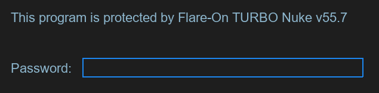
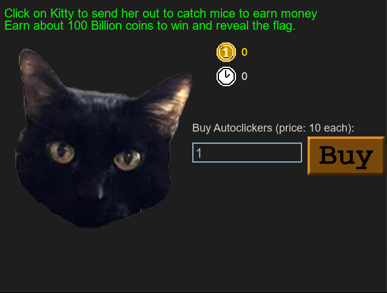

# Challenge 1 - Fidler

This first challenge is a Python program bundled with its source code. When we run the executable we are greeted with the following prompt:


Checking the source code we come across the following:
```py
def password_check(input):
    altered_key = 'hiptu'
    key = ''.join([chr(ord(x) - 1) for x in altered_key])
    return input == key
```

If we put this into an interactive Python session we can easily get the password:
```py
>>> altered_key = 'hiptu'
>>> key = ''.join([chr(ord(x) - 1) for x in altered_key])
>>> print(key)
ghost             
```

After inputting the password we are greeted with this auto clicker game:


Another check through the source code and we can spot the code called upon victory, as well as the game loop that calls it:
```py
def victory_screen(token):
    ...
    flag_content_label.change_text(decode_flag(token))
    ...

def game_screen():
    ...
    while not done:
        target_amount = (2**36) + (2**35)
        if current_coins > (target_amount - 2**20):
            while current_coins >= (target_amount + 2**20):
                current_coins -= 2**20
            victory_screen(int(current_coins / 10**8))
            return
        ...
    ...
```

Apparently all we need is a coin value greater than the target amount passed into the `decode_flag(token)` function. Again, we can just copy the code into a Python session and print the output:
```py
>>> def decode_flag(frob):
...     last_value = frob
...     encoded_flag = [1135, 1038, 1126, 1028, 1117, 1071, 1094, 1077, 1121, 1087, 1110, 1092, 1072, 1095, 1090, 1027,
...                     1127, 1040, 1137, 1030, 1127, 1099, 1062, 1101, 1123, 1027, 1136, 1054]
...     decoded_flag = []
...     for i in range(len(encoded_flag)):
...         c = encoded_flag[i]
...         val = (c - ((i%2)*1 + (i%3)*2)) ^ last_value
...         decoded_flag.append(val)
...         last_value = c
...     return ''.join([chr(x) for x in decoded_flag])
...
>>> target_amount = (2**36) + (2**35)
>>> token = target_amount + 1
>>> while token >= (target_amount + 2**20):
...     token -= 2**20
>>> print(decode_flag(token // 10**8))
idle_with_kitty@flare-on.com
```

Flag: `idle_with_kitty@flare-on.com`