# Challenge 10 - break

This challenge simply provides a file called `break` and the following comforting message:
```txt
As a reward for making it this far in Flare-On, we've decided to give you a break. Welcome to the land of sunshine and rainbows!
```
Although that's not very reassuring, taking a peek at the file reveals it to be a 32-bit ELF Linux executable. Let's look at the program actually executing. We enter the password to the previous challenge, and are then told that `sorry i stole your input :)` is not the correct password:

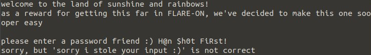

Hmm...  In IDA the function call that stands out the most is `ptrace`, which is called 57 times!

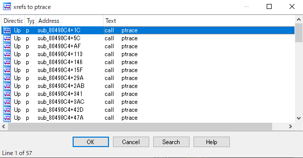

It's important to realize just how versatile [ptrace](https://www.man7.org/linux/man-pages/man2/ptrace.2.html) can be, so here are some of the arguments to it we might expect to see:

```txt
PTRACE_ATTACH   - Attach to the target process
PTRACE_PEEKDATA - Read data from the target process
PTRACE_POKEDATA - Write data to the target process
PTRACE_GETREGS  - Get the target process registers
PTRACE_SETREGS  - Set the target process registers
PTRACE_CONT     - Continue target process execution after an interrupt
```
With just these arguments you could potentially write a fully-fledged debugger, which seems likely considering how many calls are occuring. The process has two main forks which then attach to their parent and act like debuggers, intercepting certain calls and signals. Here is the first `fork` call, and it is interesting to note that this is called from `init`, before the process's `main` function even has a chance to execute:

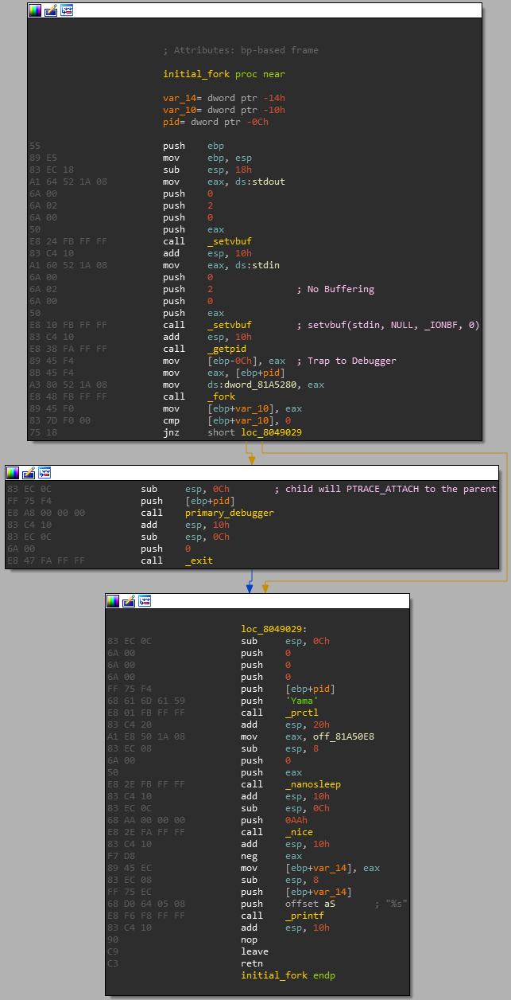

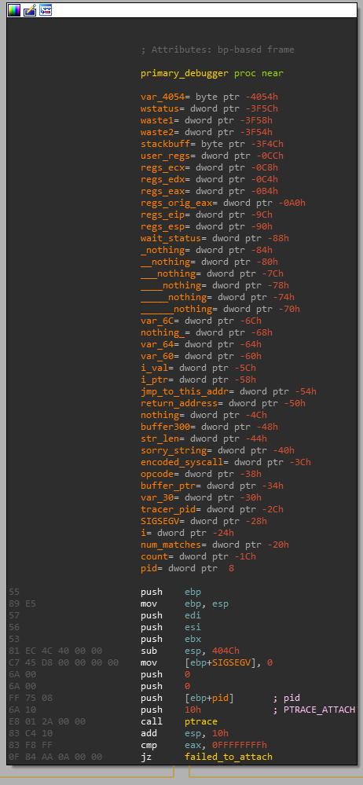

Now we have the original parent process, as well as a fork that has attached to it using `ptrace`. Also note the `_nanosleep_` call, which will give the forked child process some time to attach before the parent resumes executing after the fork call. Some similar code is called from this child fork, where a second fork is created that then attaches itself to the first fork:

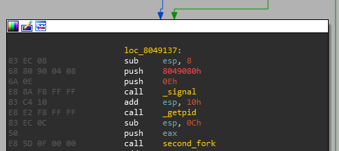

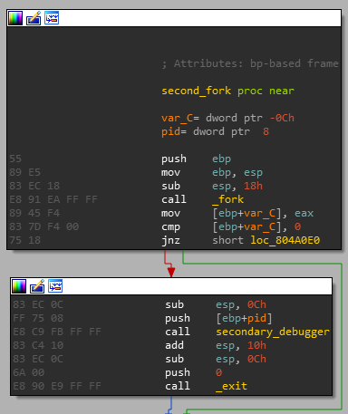

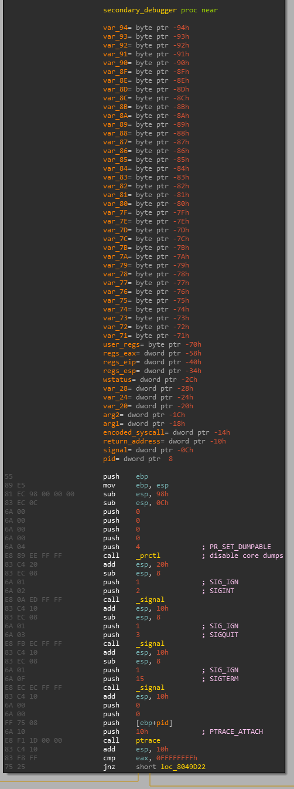

It's become a bit convoluted, but we now have our original parent process, a primary fork of the parent that has attached to the parent as a debugger, and a secondary fork of the primary fork that has attached to the primary fork as a debugger. Each of these debuggers can intercept certain calls or interrupt signals, then read and write to memory and registers.

Here's a snippit showing the primary fork load the parent process's registers onto the stack by passing `PTRACE_GETREGS`, followed by the register structure it's using:

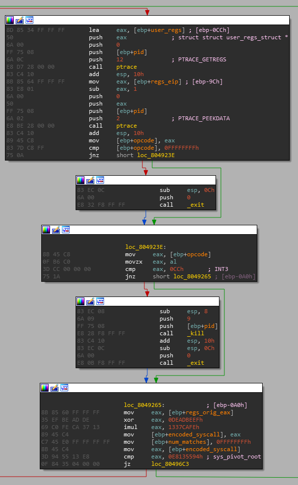
```c
struct user_regs_struct
{
  long int ebx;
  long int ecx;
  long int edx;
  long int esi;
  long int edi;
  long int ebp;
  long int eax;
  long int xds;
  long int xes;
  long int xfs;
  long int xgs;
  long int orig_eax;
  long int eip;
  long int xcs;
  long int eflags;
  long int esp;
  long int xss;
};
```
Since the registers were loaded at `ebp-0xCC`, and `(0xCC - 0xA0) / 4 = 0xB = 11`, we can see it's referencing the 12th (offset 11 from the start) struct entry ```orig_eax```. It's important to note that if `ptrace` is used to intercept syscalls, `orig_eax` will contain the number of the syscall. We can see the program do some quick obfuscation to `orig_eax` then procede to compare it to several values to determine its path of execution:

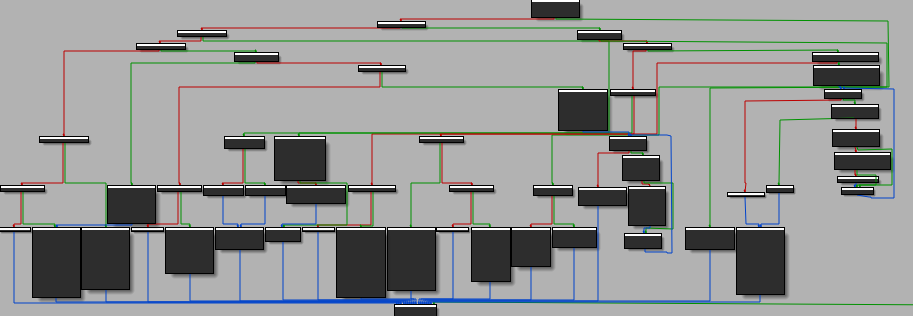

The following bash script will generate the obfuscated codes for every Linux 32-bit syscall, which can be cross-checked in the Linux source code at [syscall_32.tbl](https://github.com/torvalds/linux/blob/master/arch/x86/entry/syscalls/syscall_32.tbl).
```sh
for i in {0..335}
do
	printf "%3d: %08X\n" \
		$i               \
		$(((($i ^ 0xDEADBEEF) * 0x1337CAFE) & 0xFFFFFFFF))
done
```
Here's some examples, with the syscall number on the left and the obfuscated value and its corresponding name appended on the right:
```txt
  2: B82D3C24 sys_exit
  4: 91BDA628 sys_read
 12: F7FF4E38 sys_execve
 16: AB202240 sys_chmod
 55: 2499954E sys_ioctl
 93: 4A51739A sys_truncate
 97: 9678E7E2 sys_getpriority
 98: 83411CE4 sys_setpriority
123: 09C7A9D6 sys_newuname
153: C93DE012 sys_mlockall
218: E8135594 sys_pivot_root
```
This means, for example, that the comparison at the bottom of the IDA snippit above, `cmp eax, 0E8135594h`, is checking to see if the syscall the parent process was attempting to execute before the fork debugger intercepted it was `sys_pivot_root`, or something else. In this way, the parent process can make seemingly random calls like `call _nice`, `call _execve`, or `call _truncate`, and the debugger can arbitrarily re-route execution. The parent process becomes more like a program operating in a virtual machine, where syscalls lead to VM handler functions. 

One example VM function is the following, which occurs when the parent attempts a `sys_read`. The parent's `main` function prints some prompts then attempts to read from `stdin` to get the user to input the flag. The flag is then checked against a string, and the process exits:
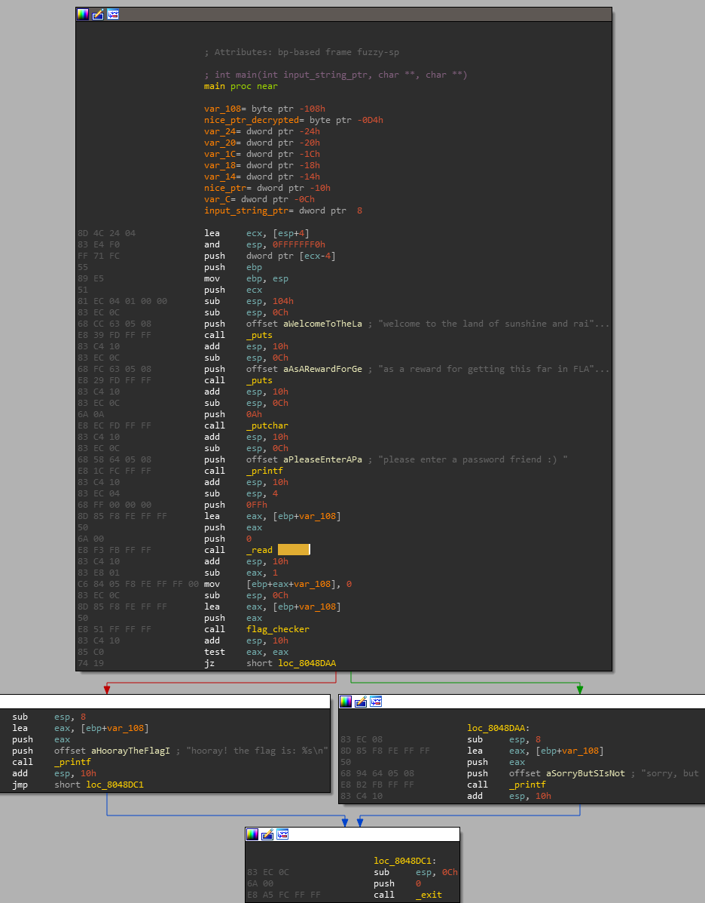

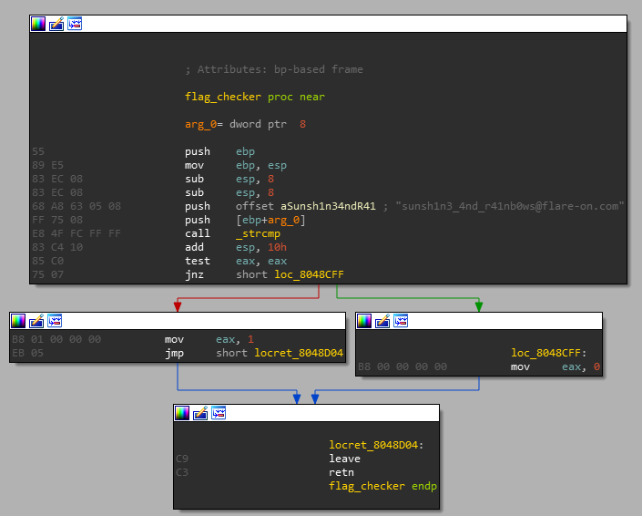

We know that the program doesn't actually seem to work so simply though, because somewhere along the way our input was overwritten. The marked `_read` operation above in the parent triggers the following VM handler function in the primary fork:

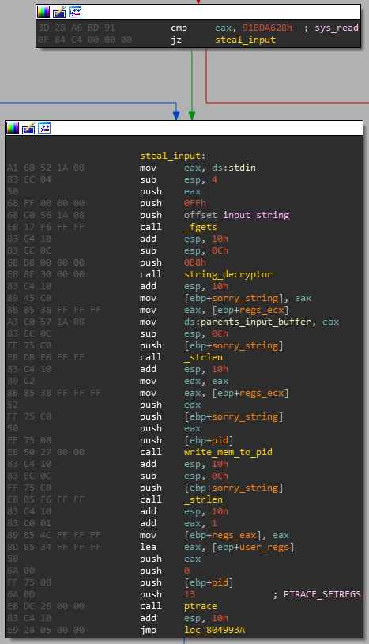

What is happening? First, the fork calls `_fgets` to actually acquire the user input. Next, `0xB8` is passed into a `string_decryptor` function, which returns a decrypted string stored at a certain index in the binary. This string is then written into the parent process's memory using `write_mem_to_pid`, which is simply a wrapper for `PTRACE_POKEDATA`.

With the following quick bash script we can modify the `0xB8` byte to be anything between `0x00 - 0xFF`. It then executes the modified program, which will replace that `sorry i stole your input :)` string we saw earlier with some other decrypted string. We can use the program output to form a list of decrypted strings, which are placed below. 

```sh
#!/bin/bash
for i in {0..255}
do
    cp break broken
    printf \\$(printf "%03o" $i)\\$(printf "%03o" $(($i >> 8))) \
        | dd of=broken bs=1 seek=5024 conv=notrunc status=none
    printf "%02x:\n" $i
    ./broken <<< "" &
    pid=$!
    (sleep 0.2; pkill -SIGKILL broken) &
    killer=$!
    wait $pid
    kill $killer
    printf "\n"
done
```
```txt
a1: I hear Wolfram Alpha is good at doing things with big numbers.
a2: There are two hard things in computer science: caching, off by one errors, and comparing really big numbers.
a3: Like a phoenix, I rise from the ashes
a4: This string has no purpose and is merely here to waste your time.
a6: There are many lessons to be learned by studying the Bee Movie.
a7: This challenge is so easy it exploits itself.
a8: moc.eralf-on@gn1hs1n1f_n0_st4rgn0c
a9: elf_0n_a_sh3lf@on-flare.com
ab: TracerPid: %d
ac: fake_flag@no-flare.com
ad: sm0l_bin_b1g_h34rt@no-flare.com
ae: okay_1_sw34r_th1s_1s_th3_r34l_0ne@no-flare.com
af: not_a_fake_flag@no-flare.com
b2: /proc/%d/status
b8: sorry i stole your input :)
b9: OOPSIE WOOPSIE!! Uwu We made a mistaky wakey!!!!
ba: This string also has no purpose and again, is here merely to waste your time.
bb: This string is used to calculate the XXTEA key to decrypt the fourth part of the flag.
bc: I HAVE THE CONCH DON'T INTERRUPT ME
be: winners never quit
bf: TracerPid:
```
Aside from some fake `@no-flare.com` flags, there's nothing too interesting in there except for the comment about using XXTEA to decrypt part of the flag.

Something else to note about the second debugger (the second fork attached to the first fork), is that although it is small and handles significantly less VM functionality than the primary debugger, its existence means we can't debug the first fork at all. We can completely patch it out however, and with some cleanup making sure execution will be the same as before, we can now debug the first fork:

Before:

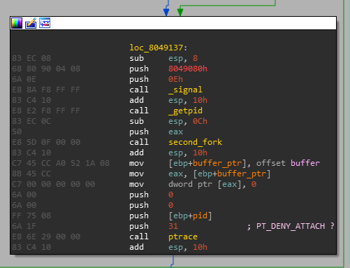

After:

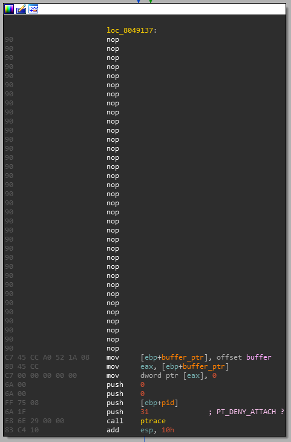

The parent's `main` function still wasn't doing anything that would lead us to the flag though, but note the following action the primary fork takes. The ASM bytes for a UD2 breakpoint are written to the beginning of the `flag_fhecker` function, so that the parent will trigger a `SIGILL` signal to the primary fork debugger:


At the bottom of the primary fork debugger handler, the program specifically checks for this signal. The first thing it does is write the input string it intercepted back into the parent process at a known location, then change the instruction pointer to an entirely new function:

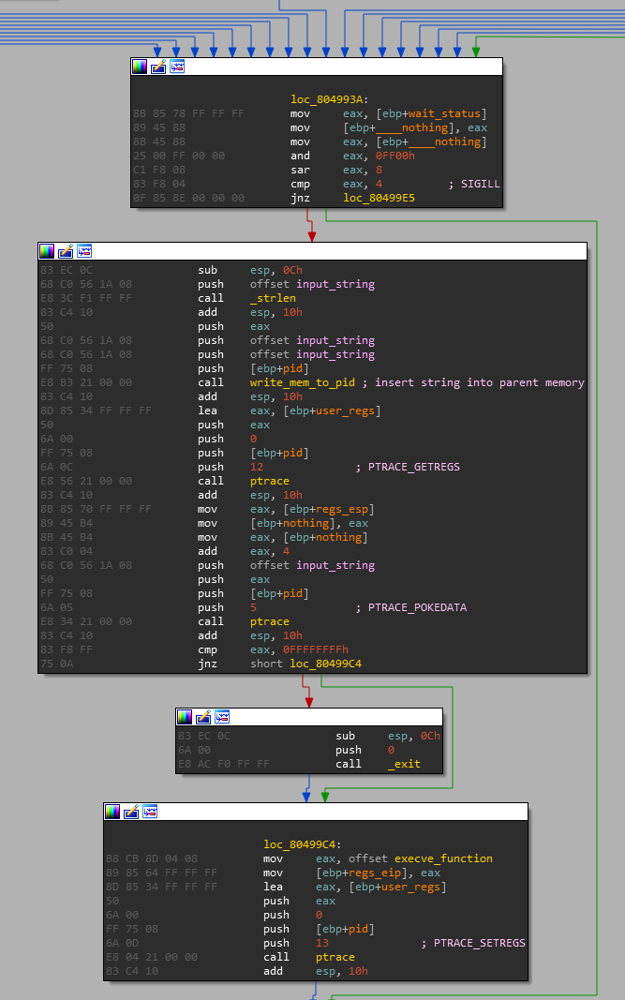

Afterwards, the parent process will now resume execution here:

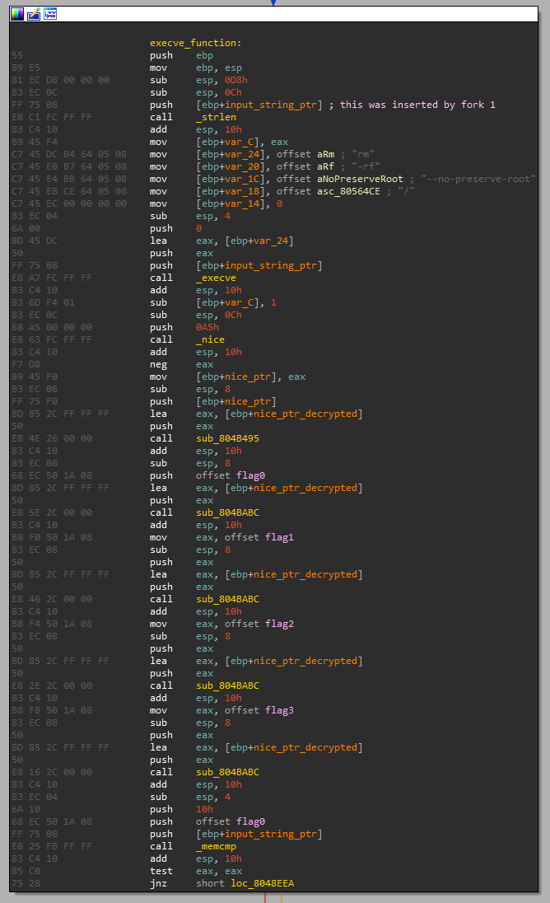

The parent process then makes some VM calls and calls some decryptor functions, and finally compares our input string to what it decrypted. A trick here is that if we modify the binary to re-route `_memcmp` calls to `puts`, and NOP out the ```push [ebp+input_string_ptr]``` so that the decrypted data pointer is at the top of the stack, we can see what its trying to compare against:

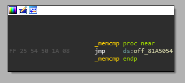

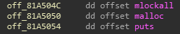

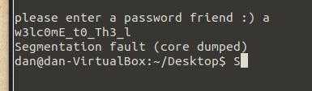

This appears to be the first part of the flag. Execution procedes to the following function call:

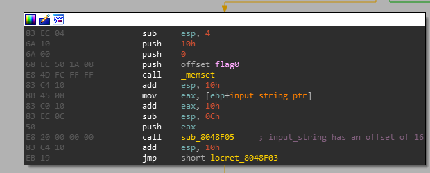

We can see it's looping over our input string, then using it somehow with a `_truncate` VM call:

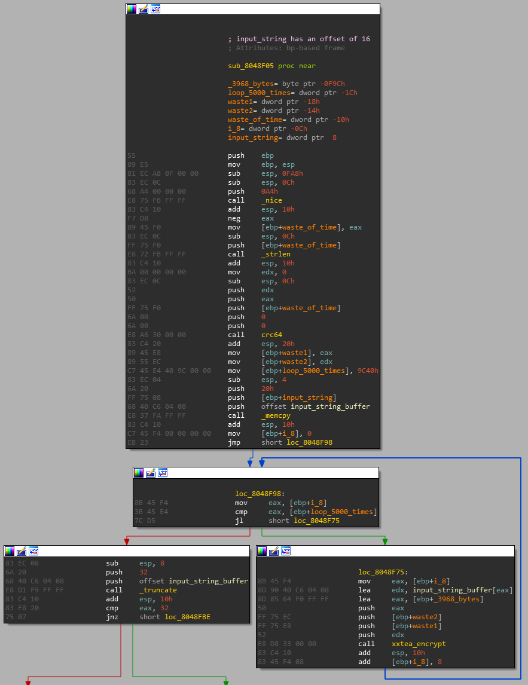

As was hinted to us in one of the decrypted strings, this part uses something similar to XXTEA encryption to encode our input bytes. It uses lots of syscalls which get handled in the primary fork debugger, some of which call NULL pointers themsleves, which then get handled by the second debugger!

Even for simply looping, the parent proces calls a NULL pointer, which sends a `SIGSEGV` signal to the primary fork debugger (`call eax` below):

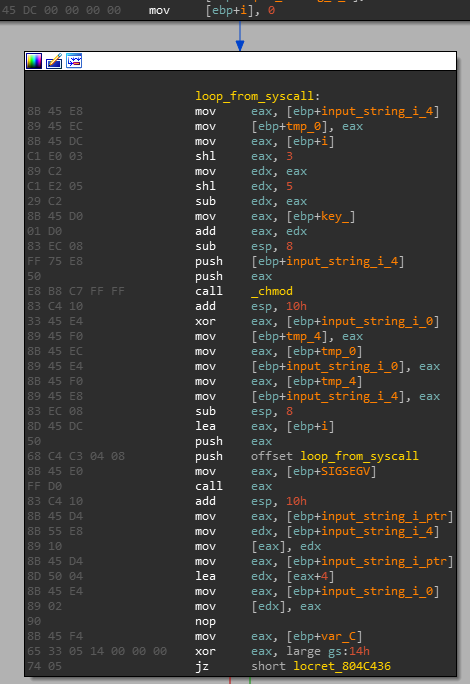

Here is where it's handled in the primary fork debugger, where the `i` loop count variable is incremented, and we loop if `i` is less than 16, othwersie we return from the call and exit the loop:

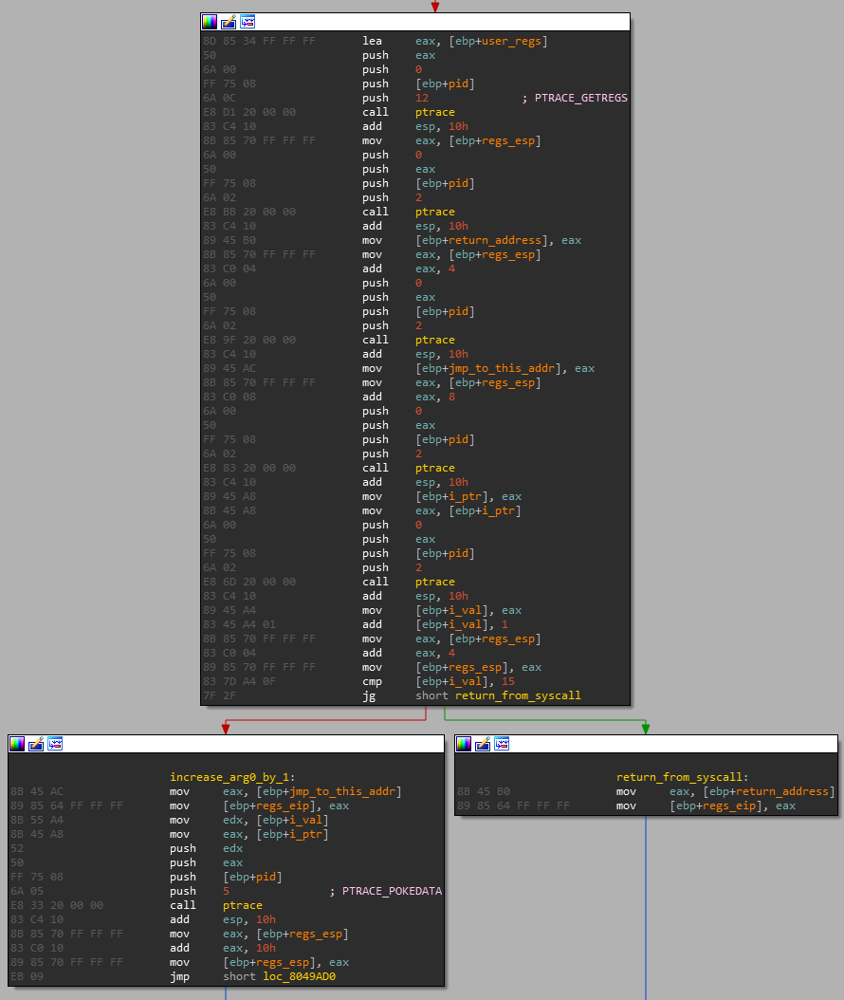

We can re-implement this ASM labyrinth in Python like so:
```py
def xxtea(data, key, encrypt):
    for z in range(0, len(data), 8):
        dword1 = int.from_bytes(data[z:z+4], "little")
        dword2 = int.from_bytes(data[z+4:z+8], "little")

        r = []
        if encrypt:
            r = range(16)
        else:
            r = range(15, -1, -1)
        for i in r:
            tmp = dword2
            dword2 += key[i*3]
            dword2 &= 0xFFFFFFFF
            dword2 = (dword2 >> (key[i*3+2] & 31)) | (dword2 << (-key[i*3+2] & 31))
            dword2 &= 0xFFFFFFFF
            dword2 ^= key[i*3+1]
            dword2 ^= dword1
            dword1 = tmp

        data[z+0:z+4] = dword2.to_bytes(4, "little")
        data[z+4:z+8] = dword1.to_bytes(4, "little")
```

Then we can plug in this encoded value that it is comparing our XXTEA encrytped input to:

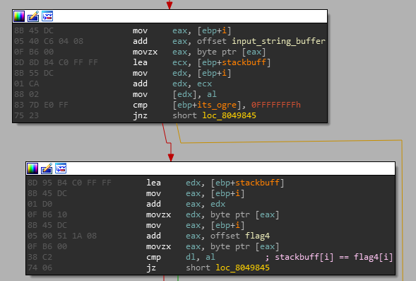

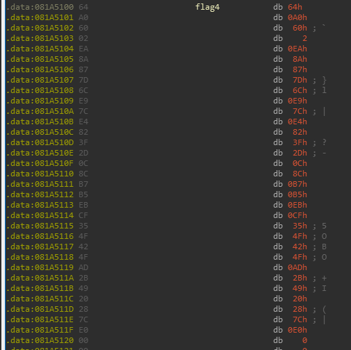

Running this data throuugh the decryption function yields the second part of the flag:
```py
>>> bin = []
>>> with open("break", "rb") as file:
...     bin = bytearray(file.read())
... 
>>> flag2 = bin[0x0015C100:0x0015C120]
>>> xxtea(flag2, key, False)
>>> print(flag2.decode("ascii"))
4nD_0f_De4th_4nd_d3strUct1oN_4nd
```

We still don't have the full flag, but if we look back at the loop that was comparing our XXTEA encrypted input to data in the binary, something that stands out is how long the loop continues on for, because the flag certanly isn't `39999 (0x9C3F)` bytes long:

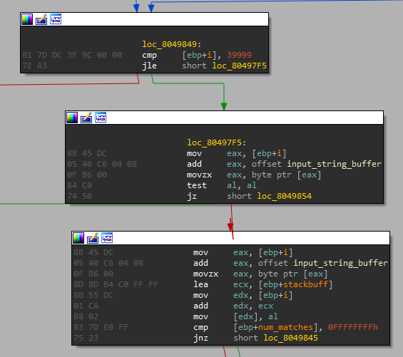

In fact, this loop is much larger than the size allocated for the stack buffer, and if it goes too far, it will start corrupting the stack:

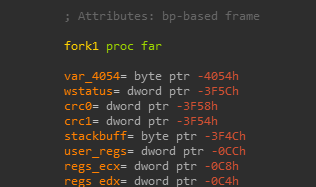

If we breakpoint at the end of the loop we can verify that EDX is now pointing at a variable well beyond the stack buffer:

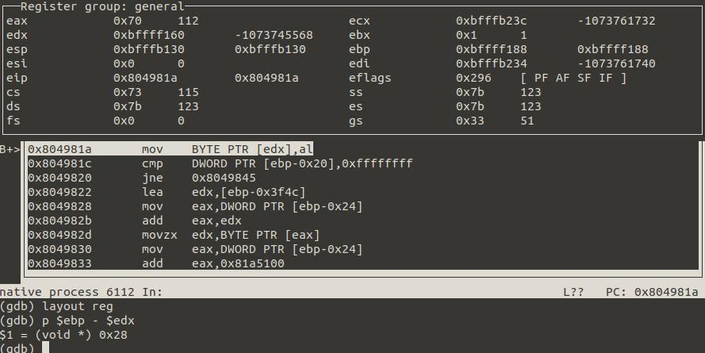

This `0x28` offset belongs to the stack variable I've named `SIGSEGV`. We can see that usually it contains 0, and if the primary fork were to call this variable, it would trigger a `SIGSEGV` signal and be handled in the secondary fork debugger:

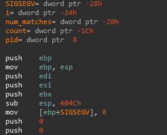

What is being written into this variable? Apparently, the offset `0x08053b70`:

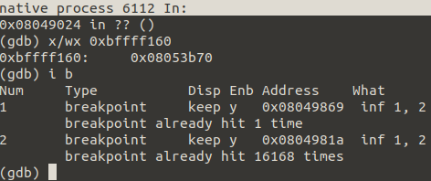

Normally, if we were to look at this address we would see nothing of interest:

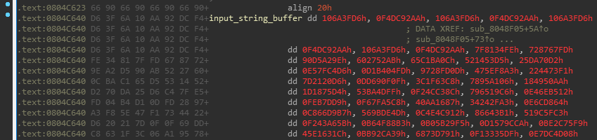

### . . .

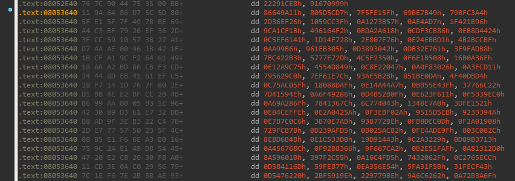

However, when the XXTEA encryption was running madly through all that memory, the bytes at this address became actual code. More specifically, the bytes became a full transcript of the Bee Movie with some code inside of it... Note the `00` byte after the highlighted little-endian address, because the code stops copying data when it hits that zero, so it doesn't destroy too much of the stack:

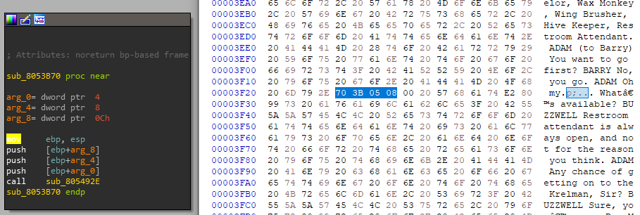

In the memory dump we can see the region where it transitions from the Bee Movie script into actual 32-bit ASM as well:

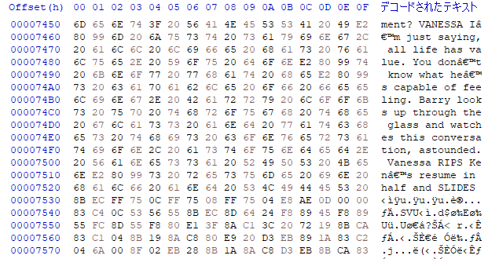

Now the code procedes to call the value in the `SIGSEGV` variable, which used to be 0 and would have been triggered a `SIGSEGV` error signal to be intercepted by the secondary fork debugger, but is now pointing into the unencrypted data region, which contains hidden ASM:

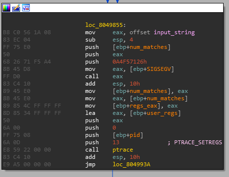

Inside this secret code, it first verifies that we have correctly matched the first 32 (0x20) characters of the flag:

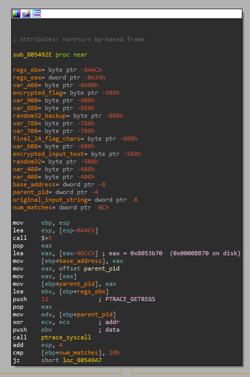

This last bit requires more ingenuity than brute force analysis; there are upwards of 20 function calls, most of which are different from each other and can go more than 5 nested function calls deep, or contain triple nested loops. The quickest way to figure these out is by debugging them and seeing their inputs and outputs, but remember it's impossible to debug this process without first stripping out the second fork so that we can attach to the first fork, which includes making sure all of its VM functionality is properly replicated.

Anyways, we can see the first three calls are zeroing out memory, whereas the next batch of calls takes in hex strings stored in the decrypted movie script as plain text and converts them into actual bytes on the stack:

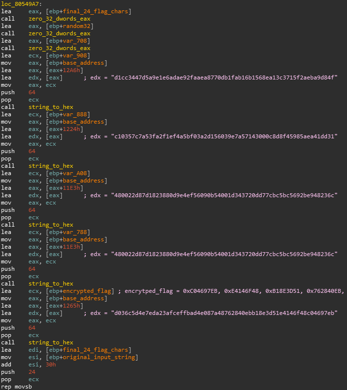

Next it does some extremely large multiplication, division, and subtraction using these enormous numbers, along with the bytes from our input and some random numbers for obfuscation:


Here's one of the math operations, so we can see just how messy the library it's using can look in ASM:

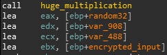

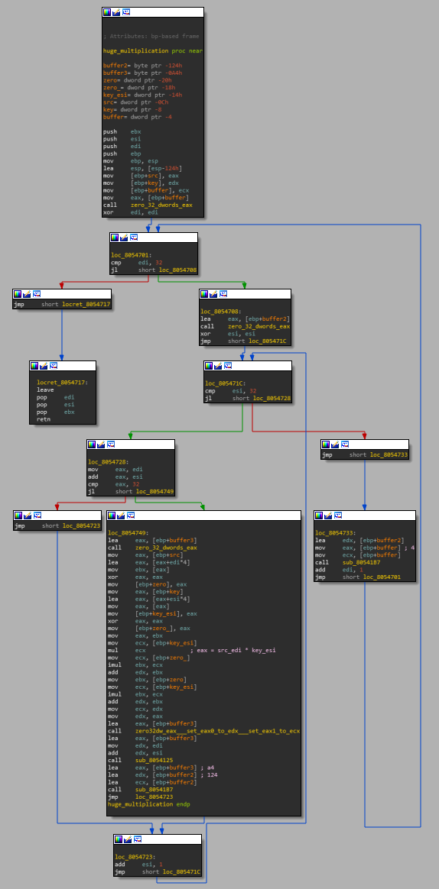

We see lots of subcalls inside all of those nested loops, but if you look at the inputs and outputs of the function you can see that the final output is divisible by the inputs, so we can determine it was a multiplication function.

One of the inputs into these huge math operations was our input flag, and when all these math calls are finished, it compares it to what is likely the final part of the flag, before allowing the program to succeed:

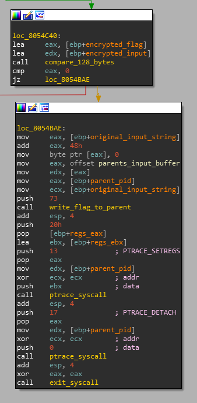

If we unravel the math operations it does, the end result is essentially

```py
encrypted_input = (input_bytes * a) - ((input_bytes * a) // m) * m
```
where `input_bytes` are the bytes of the string we input into the program, `encrypted_input` are the bytes after the large math operations, `a` and `m` are some of those large hex strings from above, and `//` is the floor-rounding integer division operator. Since it compares this directly to `encrypted_flag`, we know that if we substitute in `encrypted_flag` for `encrypted_input` in the equation, then we can solve for `input_bytes` and get the flag!

The equation then becomes:

```py
encrypted_flag = (flag_bytes * a) - ((flag_bytes * a) // m) * m
encrypted_flag = (flag_bytes * a) %  m
flag_bytes * a ≡ encrypted_flag (mod m)
```
We can use Python 3.8's `pow()` to calculate the multiplicitive inverse of `a` for `m`, then solve for `flag_bytes`:
```py
i = pow(a, -1, m)
flag_bytes = (i * encrypted_flag % m)
```

Now we just plug in the values from the decrypted data section:
```py
>>> encrypted_flag = 0xd036c5d4e7eda23afceffbad4e087a48762840ebb18e3d51e4146f48c04697eb
>>> m = 0xd1cc3447d5a9e1e6adae92faaea8770db1fab16b1568ea13c3715f2aeba9d84f
>>> b = 0xc10357c7a53fa2f1ef4a5bf03a2d156039e7a57143000c8d8f45985aea41dd31
>>> flag_bytes = (pow(b, -1, m) * encrypted_flag % m)
>>> print(hex(flag_bytes))
0x6d6f632e6e6f2d6572616c6640733369707075705f306e5f
>>> print(flag_bytes.to_bytes(24, "little").decode("ascii"))
_n0_puppi3s@flare-on.com
```
Let's collect all the pieces of the flag we have now and put them together:
```txt
1: w3lc0mE_t0_Th3_l
2: 4nD_0f_De4th_4nd_d3strUct1oN_4nd
3: _n0_puppi3s@flare-on.com
```

Flag: `w3lc0mE_t0_Th3_l4nD_0f_De4th_4nd_d3strUct1oN_4nd_n0_puppi3s@flare-on.com`

&nbsp;

Click here for the Python 3.8+ script to generate the flag. Note that it requires the `break` binary, which it reads data from:
[rainbows.py](../_resources/rainbows.py)