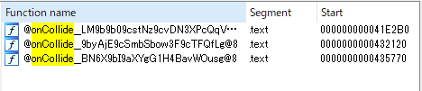
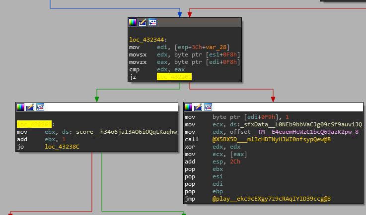
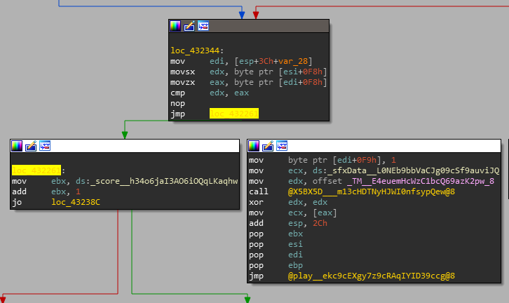
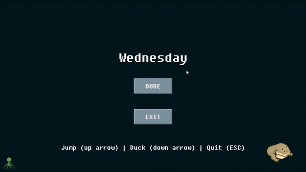

# Challenge 3 - wednesday

This challenge provides a fully fuctioning video game, along with the following prompt:
```txt
██╗    ██╗███████╗██████╗ ███╗   ██╗███████╗███████╗██████╗  █████╗ ██╗   ██╗
██║    ██║██╔════╝██╔══██╗████╗  ██║██╔════╝██╔════╝██╔══██╗██╔══██╗╚██╗ ██╔╝
██║ █╗ ██║█████╗  ██║  ██║██╔██╗ ██║█████╗  ███████╗██║  ██║███████║ ╚████╔╝ 
██║███╗██║██╔══╝  ██║  ██║██║╚██╗██║██╔══╝  ╚════██║██║  ██║██╔══██║  ╚██╔╝  
╚███╔███╔╝███████╗██████╔╝██║ ╚████║███████╗███████║██████╔╝██║  ██║   ██║   
 ╚══╝╚══╝ ╚══════╝╚═════╝ ╚═╝  ╚═══╝╚══════╝╚══════╝╚═════╝ ╚═╝  ╚═╝   ╚═╝   

                        --- BE THE WEDNESDAY ---

                                   S
                                   M
                                   T
                                  DUDE
                                   T
                                   F
                                   S

                --- Enable accelerated graphics in VM ---
                  --- Attach sound card device to VM ---
                    --- Only reverse mydude.exe ---
                       --- Enjoy it my dudes ---
```

After some initial testing of the game, we can determine that points are earned by ducking under "Sunday", "Monday", or "Tuesday" blocks, and jumping over "Thursday", "Friday", or "Saturday" blocks.

For reference, a Sunday and Monday block looks like the following:


Points increase for successful dodges, but you must actively play the game to progress. Lets check the assembly for the collision detection:


Inside the second function listed, there is a branch where the code will either play a noise and terminate, or increase a counter:


Let's try changing this code to only take the left branch:


If we try out the game now, we can dodge all blocks just by holding down. Applying a speedhack to make the game progress faster gives us the flag:



Flag: `1t_i5_wEdn3sd4y_mY_Dud3s@flare-on.com`
