# Challenge 5 - TKApp

The `TKApp.tpk` file provided with this challenge is, according to the challenge description, some form of mobile app for a watch. Looking up the format online reveals `.tpk` files can be run on the `Tizen` mobile OS. Closer inspection of the file reveals that it can be extracted as a simple ZIP archive:

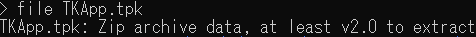
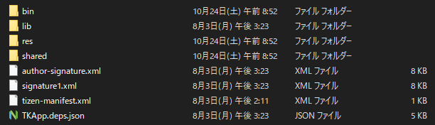

The binaries themselves for this challenge are located inside the `bin` folder:
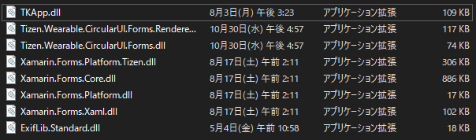

`TKApp.dll` is the only file with a modification date in this year, and the other files all appear to be helper libraries, so this is likely the primary point of execution. A quick look in IDA lets us know that the binary is a .NET assembly, and reminds us that we don't have the expensive IDA license required to view it!
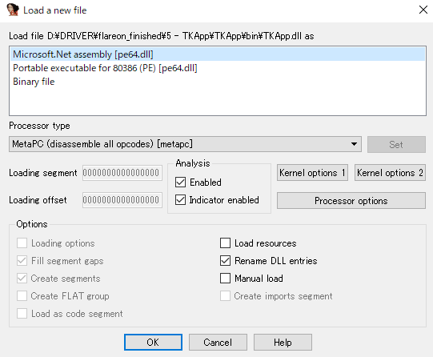
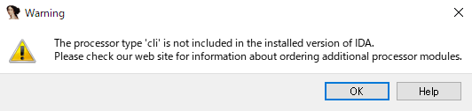

Fortunately [__dnSpy__](https://github.com/dnSpy/dnSpy/releases) is better equipped to deal with .NET, and loading in the binary gives us the following overview:
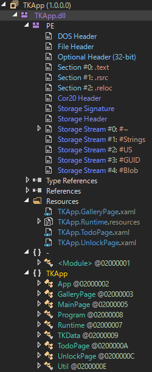

The first snippits of code that stand out after looking through these C# classes are the following:
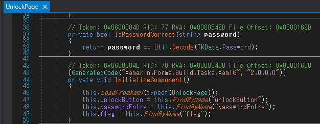

The `Decode` function and `TKData.Password` variable are defined as follows:

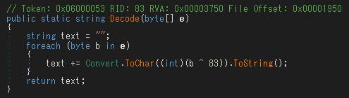
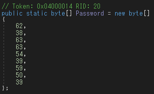

With a simple XOR loop we can get `UnlockPage`'s password, `"mullethat"`. Checking references to `IsPasswordCorrect` shows us that this password gets stored in `App.Password`:

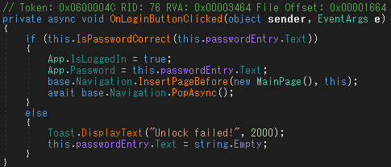

Tracing the references to `App.Password` leads us to the following `GetImage` function:
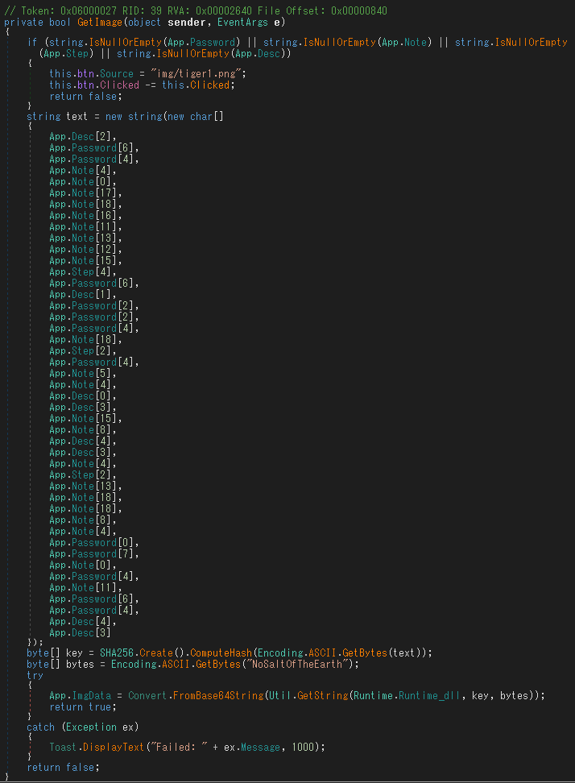

It looks like `App.Password`, `App.Note`, `App.Step`, and `App.Desc` are four components being used to craft some kind of string used to generate a `SHA256` key, so we'll need to find these other three components too.

For `App.Note` we check the references which brings us to the following code snippet:


The value we want is set at the bottom, and working our way backwards we can see that items from the `todo` variable are only added to `list2` if the `Done` field is `false`. Hovering over `Todo` reveals the following structure, which shows us what we're working with:


This means `App.Note` will either be `"and enable GPS"` or `"keep steaks for dinner"`, but it seems likely to be the second one since this one only occurs if `this.isHome` is true, which sounds like some kind of security measure.

Next up is `App.Step`, which is set from the current application's `"its"` metadata field:
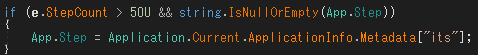

A quick grep search (in this case [The Silver Searcher](https://github.com/ggreer/the_silver_searcher))  let's us quickly find this metadata key's value, `"magic"`:
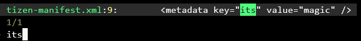

All that's left is `App.Desc`, which is apparently stored in the `ImageDescription` of `gallery\05.jpg`'s EXIF data:
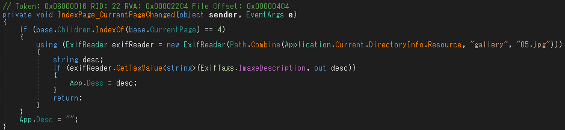

We can use exiftool to reveal that the image description is `"water"`:
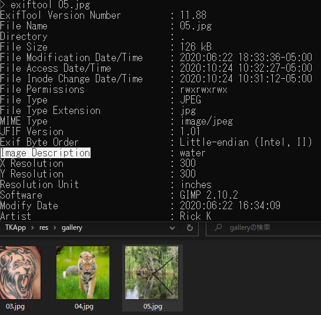

All together we have the following, which we can combine in Python using the same method the app does to create the `text` variable:
```py
>>> Password = "mullethat"
>>> Note     = "keep steaks for dinner"
>>> Step     = "magic"
>>> Desc     = "water"
>>> text = Desc[2] + Password[6] + Password[4] + Note[4] + Note[0] + Note[17] + Note[18] + Note[16] + Note[11] + Note[13] + Note[12] + Note[15] + Step[4] + Password[6] + Desc[1] + Password[2] + Password[2] + Password[4] + Note[18] + Step[2] + Password[4] + Note[5] + Note[4] + Desc[0] + Desc[3] + Note[15] + Note[8] + Desc[4] + Desc[3] + Note[4] + Step[2] + Note[13] + Note[18] + Note[18] + Note[8] + Note[4] + Password[0] + Password[7] + Note[0] + Password[4] + Note[11] + Password[6] + Password[4] + Desc[4] + Desc[3]
>>> print(text)
the kind of challenges we are gonna make here
```

Looking back at the code that created the `text` variable, to complete the challenge we just need to get the `SHA256` of the `text` variable and pass it, along with the byte string `"NoSaltOfTheEarth"` into the following function, then decode the output from BASE64:
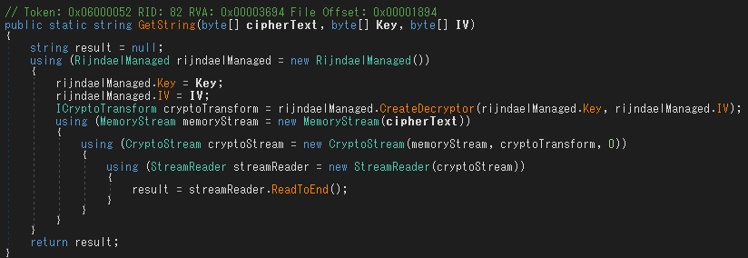

Note that the `Runtime.Runtime_dll` file passed into this function as `byte[] cipherText` can be acquired from the app's `Resources` section:

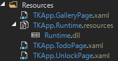

Re-implementing the above function (AES decryption) in Python yields the following:
```py
>>> from hashlib import sha256 
>>> from Crypto.Cipher import AES
>>> from base64 import b64decode
>>> key = sha256(text.encode("UTF-8")).digest()
>>> iv = "NoSaltOfTheEarth"
>>> cipherText = []
>>> with open("Runtime.dll", "rb") as file:
...     cipherText = bytearray(file.read())
... 
>>> rijndael = AES.new(key, AES.MODE_CBC, iv)
>>> flag_base64 = rijndael.decrypt(bytes(cipherText))
>>> flag = b64decode(flag_base64)
>>> with open("flag.jpg", "wb") as file:
...     file.write(flag)
... 
62532
```
Opening the output `flag.jpg` file gives us the flag:


Flag: `n3ver_go1ng_to_recov3r@flare-on.com`