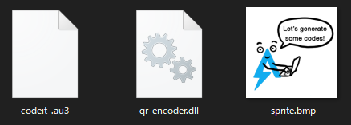
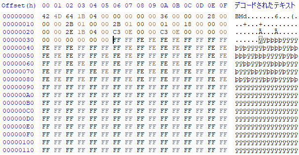
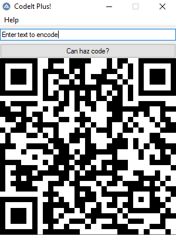
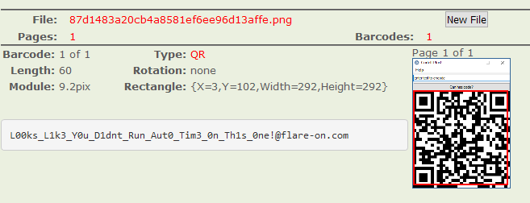

6 - codeit

# Challenge 6 - codeit

When we first extract ```codeit.exe```, we note that it is packed with UPX. Unpacking it and running ```strings -e l``` on it to get the UTF-16LE strings reveals some interesting output:
```sh
EAutoIt v3
TaskbarCreated
Script Paused
Exit
/AutoIt3ExecuteScript
/AutoIt3ExecuteLine
/AutoIt3OutputDebug
/ErrorStdOut
CMDLINE
CMDLINERAW
>>>AUTOIT NO CMDEXECUTE<<<
```
There's much more, but it seems that this is a compiled AutoIt 3 script. Decompiling the .exe with an AutoIt decompiler gives us an obfuscated mess of a script, along with the .bmp the script displays and an external QR-code generator library:


Some extracts of the script are as follows:
```autoit
#OnAutoItStartRegister "AREIHNVAPWN"
Global $os
Global $flavekolca = Number(" 0 "), $flerqqjbmh = Number(" 1 "), $flowfrckmw = Number(" 0 "), $flmxugfnde = Number(" 0 "), $flvjxcqxyn = Number(" 2 "), $flddxnmrkh = Number(" 0 "), $flroseeflv = Number(" 1 "), $flpgrglpzm = Number(" 0 "), $flvzrkqwyg = Number(" 0 "), $flyvormnqr = Number(" 0 "), $flvthbrbxy = Number(" 1 "), $flxttxkikw = Number(" 0 "), $flgjmycrvw = Number(" 1 "), $flceujxgse = Number(" 0 "), $flhptoijin = Number(" 0 "), $flrzplgfoe = Number(" 0 "), $fliboupial = Number(" 0 "), $flidavtpzc = Number(" 1 "), $floeysmnkq = Number(" 1 "), $flaibuhicd = Number(" 0 "), $flekmapulu = Number(" 1 ")
Global $flwecmddtc = Number(" 1 "), $flwjxfofkr = Number(" 0 "), $flhaombual = Number(" 0 "), $fldtvrladh = Number(" 1 "), $flpqigitfk = Number(" 1 "), $flbxttsong = Number(" 1 "), $fljlrqnhfc = Number(" 0 "), $flemdcrqdd = Number(" 6 "), $flmmamrwab = Number(" 3 "), $fldwuczenf = Number(" 1 "), $flrdaskyvd = Number(" 0 "), $flbafslfjs = Number(" 6 "), $flndzdxavp = Number(" 4 "), $flfgifsier = Number(" 1 "), $flfbqjbpgo = Number(" 1 "), $flsgvsfczm = Number(" 0 "), $flmzrdgblc = Number(" 0 "), $flcpxdpykx = Number(" 0 "), $flbddrzavr = Number(" 3 "), $flkpxipgal = Number(" 0 "), $flsxhsgaxu = Number(" 0 "), $flqfpqbvok = Number(" 0 "), $flrubfcaxm = Number(" 0 "), $flqcktzayy = Number(" 2 "), $fliwgresso = Number(" 0 ")
Global $flywpbzmry = Number(" 0 "), $flqgmnikmi = Number(" 1 "), $flgmsyadmq = Number(" 2 "), $flocbwfdku = Number(" 1 "), $flgxbowjra = Number(" 2 "), $flmjqnaznu = Number(" 1 "), $flsgwhtzrv = Number(" 0 "), $flfvhrtddd = Number(" 0 "), $flrrpwpzrd = Number(" 3 "), $flrtxuubna = Number(" 1 "), $fljgtgzrsy = Number(" 1 "), $flsgrrbigg = Number(" 1 "), $fljkeopgvh = Number(" 1 "), $flsvfpdmay = Number(" 0 "), $flqwzpygde = Number(" 0 "), $flvjqtfsiz = Number(" 1 "), $flypdtddxz = Number(" 0 "), $flcxaaeniy = Number(" 1 "), $flxaushzso = Number(" 1 "), $flxxqlgcjv = Number(" 1 "), $flavacyqku = Number(" 0 "), $flviysztbd = Number(" 7 "), $flpdfbgohx = Number(" 0 "), $flfegerisy = Number(" 7 "), $flilknhwyk = Number(" 0 ")

Func areoxaohpta($flmojocqtz, $fljzkjrgzs, $flsgxlqjno)
	Local $flfzxxyxzg[$flmtlcylqk]
	$flfzxxyxzg[$flegviikkn] = DllStructCreate(arehdidxrgk($os[$flmhuqjxlm]))
	DllStructSetData($flfzxxyxzg[$flmssjmyyw], arehdidxrgk($os[$flxnxnkthd]), ($flhzxpihkn * $flmojocqtz + Mod($flmojocqtz, $flwioqnuav) * Abs($fljzkjrgzs)))
	DllStructSetData($flfzxxyxzg[$flmivdqgri], arehdidxrgk($os[$flldooqtbw]), $flehogcpwq)
	DllStructSetData($flfzxxyxzg[$flmbbmuicf], arehdidxrgk($os[$flsfwhkphp]), $flwybtlyiv)
	...
	Return $flfzxxyxzg
EndFunc

Func areihnvapwn()
	Local $dlit = "7374727563743b75696e7420626653697a653b75696e7420626652657365727665643b75696e742062664f6666426974733b"
	$dlit &= "75696e7420626953697a653b696e7420626957696474683b696e742062694865696768743b7573686f7274206269506c616e"
	$dlit &= "65733b7573686f7274206269426974436f756e743b75696e74206269436f6d7072657373696f6e3b75696e7420626953697a"
	$dlit &= "65496d6167653b696e742062695850656c735065724d657465723b696e742062695950656c735065724d657465723b75696e"
	...
	Global $os = StringSplit($dlit, "4FD5$", 1)
EndFunc

Func arehdidxrgk($flqlnxgxbp)
	Local $flqlnxgxbp_
	For $flrctqryub = 1 To StringLen($flqlnxgxbp) Step 2
		$flqlnxgxbp_ &= Chr(Dec(StringMid($flqlnxgxbp, $flrctqryub, 2)))
	Next
	Return $flqlnxgxbp_
EndFunc
```
What a mess! The last function is used frequently throughout the program to turn the hex string defined in ```areihnvapwn()``` into valid text. Using some Python to transform the hexstring and VIM macros to replace all the obfuscating functions with their real values, we get much more readable output. Here's some excerpts:

```autoit
Func create_bmp($width, $height, $unused)
	Local $bmp_header[2]
	$bmp_header[0] = DllStructCreate("struct;uint bfSize;uint bfReserved;uint bfOffBits;uint biSize;int biWidth;int biHeight;ushort biPlanes;ushort biBitCount;uint biCompression;uint biSizeImage;int biXPelsPerMeter;int biYPelsPerMeter;uint biClrUsed;uint biClrImportant;endstruct;")
	DllStructSetData($bmp_header[0], "bfSize", (3 * $width + Mod($width, 4) * Abs($height)))
	DllStructSetData($bmp_header[0], "bfReserved", 0)
	DllStructSetData($bmp_header[0], "bfOffBits", 54)
	...
	Return $bmp_header
EndFunc

Local $crypto_service = DllStructCreate("struct;ptr;ptr;dword;byte[32];endstruct")
DllStructSetData($crypto_service, 3, 32)
Local $success = DllCall("advapi32.dll", "int", "CryptAcquireContextA", "ptr", DllStructGetPtr($crypto_service, 1), "ptr", 0, "ptr", 0, "dword", 24, "dword", 4026531840)
```
Looking through the de-obfuscated script, we can see that in the general program flow is as follows:
1. Get user input.
2. Check if the user should be given the flag:
	* If the user should be given the flag, use the flag for the QR code.
	* If not, use the user input for the QR code.
3. Generate the QR code bitmap.

The part where the script determines if the user should be given the flag is a bit convoluted. Some pseudo code of it would be:
```c
char *input_str = get_input();

char computer_name[1024];
GetComputerNameA(computer_name, 1024);
computer_name = tolower(computer_name);

char bmp_data[] = load_file("sprite.bmp");

// transform the computer name
int i, b, s;
char trans;

for(i = 0;i < strlen(computer_name);i++)
{
	b = 0;
	trans = computer_name[i];
	for(s = 6;s >= 0;s--)
		trans += (bmp_data[b++] & 1) << s;
	computer_name[i] = (trans >> 1) + ((trans & 1) << 7);
}

char encrypted_data[176] = {0xCD, 0x4B, 0x32, 0xC6, 0x50, ..., 0x52};
char decryption_key[32] = sha256(computer_name);

success = CryptDecrypt(encrypted_data, decryption_key);

if(success)
	input_str = encrypted_data;

generate_qr_code(input_str);
```

It's more involved than that, but in general the script uses Windows .dll calls to get the computer name, transform it using data from the supplied .bmp file, then attempt to use it as a key to decrypt some encrypted data. If it succeeds in doing so, it will replace the input string with the flag and show the QR code for that instead.

Something interesting to note is that when it transforms the computer name, it uses 7 bytes from the .bmp per char. Also, each byte from the .bmp is either `0xFF` or `0xFE`:


Remembering that UTF-8 uses 7 bits to encode characters, and that the .bmp is using 7 bytes per character each being ANDded with 1 then shifted, we might want to take a closer look at each pair of 7 bytes from the .bmp:

```py
FF FF FE FE FE FE FF -> 1100001 -> 'a'
FF FF FF FE FF FE FF -> 1110101 -> 'u'
FF FF FF FE FF FE FE -> 1110100 -> 't'
FE FF FF FE FE FE FE -> 0110000 -> '0'
FE FF FF FE FE FE FF -> 0110001 -> '1'
FF FF FF FE FF FE FE -> 1110100 -> 't'
FF FF FE FE FF FF FE -> 1100110 -> 'f'
FF FF FE FE FE FE FF -> 1100001 -> 'a'
FF FF FE FF FF FF FE -> 1101110 -> 'n'
FE FF FF FE FE FE FF -> 0110001 -> '1'
FE FF FF FF FE FE FF -> 0111001 -> '9'
FE FF FF FF FE FE FF -> 0111001 -> '9'
FE FF FF FF FE FE FF -> 0111001 -> '9'
'aut01tfan1999'
```

Success? A quick change of the VirtualBox computer name to ```aut01tfan1999``` reveals the QR code with the flag:






Flag: `L00ks_L1k3_Y0u_D1dnt_Run_Aut0_Tim3_0n_Th1s_0ne!@flare-on.com`

&nbsp;

Click here for the de-obfuscated AutoIt script:
[codeit_.au3](../_resources/codeit_.au3)

