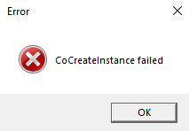
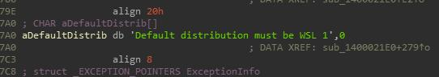
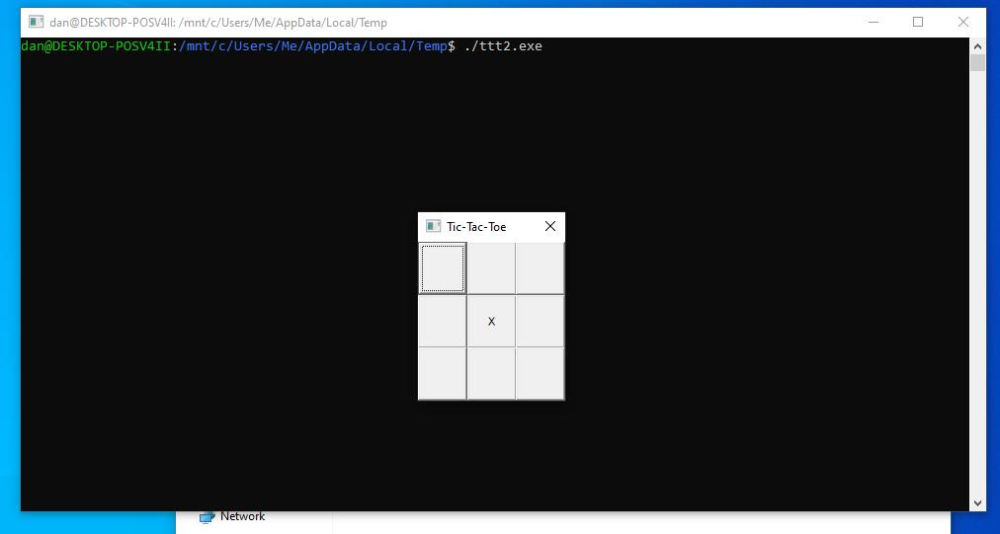
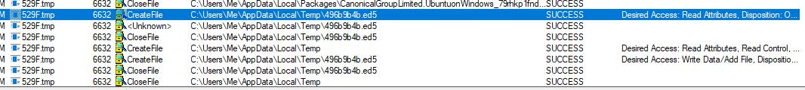
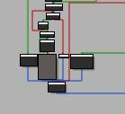
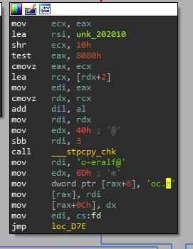
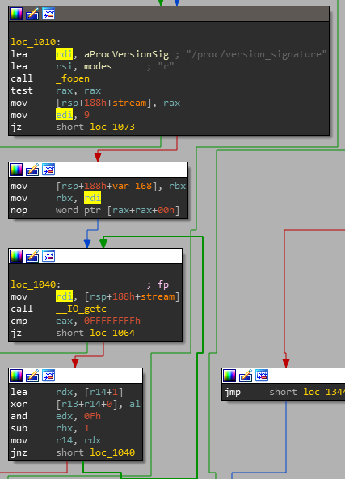
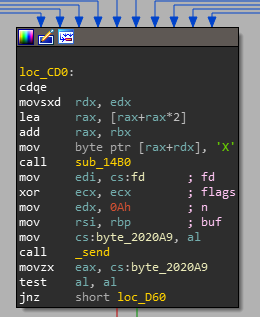
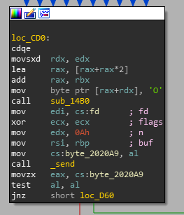
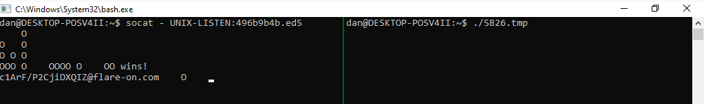

8 - Aardvark

# Challenge 8 - Aardvark

This challenge provides us with the binary `ttt2.exe`, but it fails to execute:


Looking around in it we find the following string, which suggests this binary might require the Windows Subsystem for Linux (WSL):


Installing WSL and running the executable finally allows a tic-tac-toe game to start up:


The game is pretty straight forward; since the AI takes the first move by placing an `X` in the center, the game is unwinnable and always results in a loss. A view of Process Monitor shows that the `ttt2.exe` binary creates a socket file at the location below. It also creates a `.tmp` file, which is a Linux ELF binary that is executed using WSL. The two binaries communicate via the socket file, and the AI that we play tic-tac-toe against is running on this Linux binary:


At the bottom of the Linux binary's `main` function is this `o-eralf@` string, suggesting that reaching the end of the game correctly might produce the flag:




The Linux binary also reads 9 characters from `/proc/version_signature` in a loop using ```getc```:


Checking the `/proc/version_signature` ourselves on our WSL install gives the following:
```sh
dan@DESKTOP-POSV4II:~$ cat /proc/version_signature
Microsoft 4.4.0-18362.1-Microsoft 4.4.35
```
`Microsoft` is 9 characters long; if we were on Ubuntu it would return `Ubuntu ...`, so this might also suggest that running WSL and having the signature `Microsoft` is the correct path.

The tic-tac-toe game is set up to be impossible to win, but let's try patching the Linux binary so that it sends an `O` instead of an `X`, guaranteeing a win:

The original assembly which sends `X`:

Patched to send ```O```:


Now let's start the tic-tac-toe server manually by running our modified `.tmp` Linux binary, and connect to it via the socket file using the `socat` command:

Bingo! Or was it tic-tac-toe.

Flag: `c1ArF/P2CjiDXQIZ@flare-on.com`