# Challenge 9 - crackstaller

This challenge can get a bit messy, so here is a general overview of its components to refer back to:
### Components
* __crackstaller.exe__ - Provided executable that extracts the remaining files
* __credHelper.dll__ - COM server
* __cfs.dll__ - Capcom's exploitable Street Fighter V rootkit
* __driver.sys__ - Filter driver scanning for registry changes


Immediately when we extract `crackstaller.exe` to begin the challenge, Windows Defender alerts us:
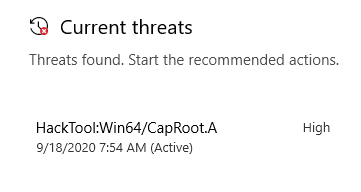

A quick search of this virus signature name reveals that Capcom's anti-cheat rootkit was detected inside the binary. If we follow the process execution in ProcMon, we can note the following:

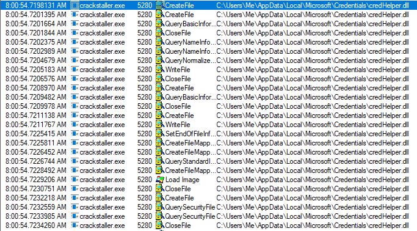

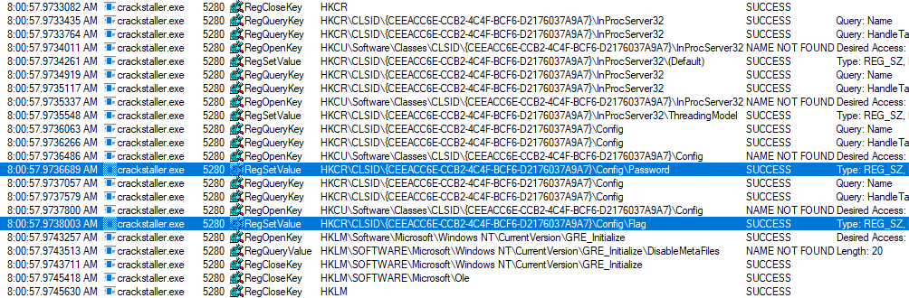

`crackstaller.exe` is extracting a file called `credHelper.dll`, then using that .dll to make some interesting registry additions by registering it as a COM server. Next up `crackstaller.exe` is creating a new kernel module `C:\Windows\System32\cfs.dll`. This could be the rootkit detected earlier. Nothing else interesting seemed to happen, and the process closed.

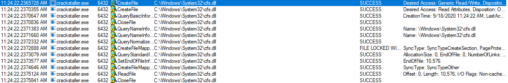

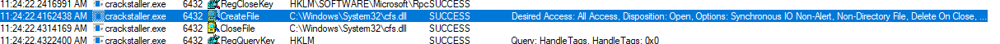


If we check the SHA-256 of `cfs.dll` on VirusTotal, we can confirm this is Capcom's rootkit:
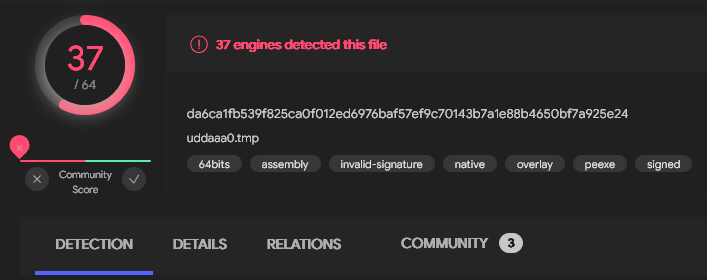

The `DeviceIoControl` import in `crackstaller.exe` is used to communicate with the rootkit:
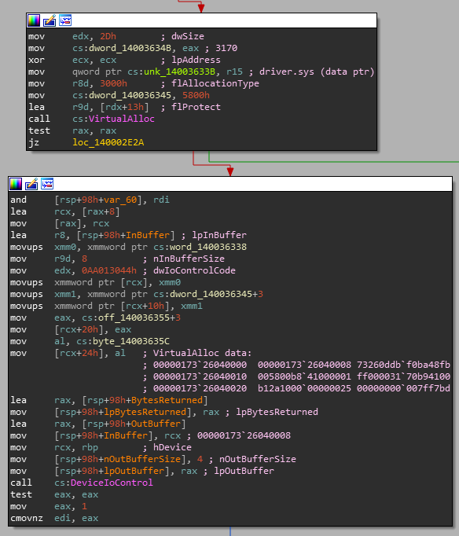

It allocates a buffer containing some ASM necessary to jump back into `crackstaller.exe` from the rootkit, but with the priviledged execution of kernel mode. It jumps to `crackstaller.exe` at `sub_140002A10`, which I have renamed `called_from_kernel` below, where it uses byte signature scanning to find NT functions:

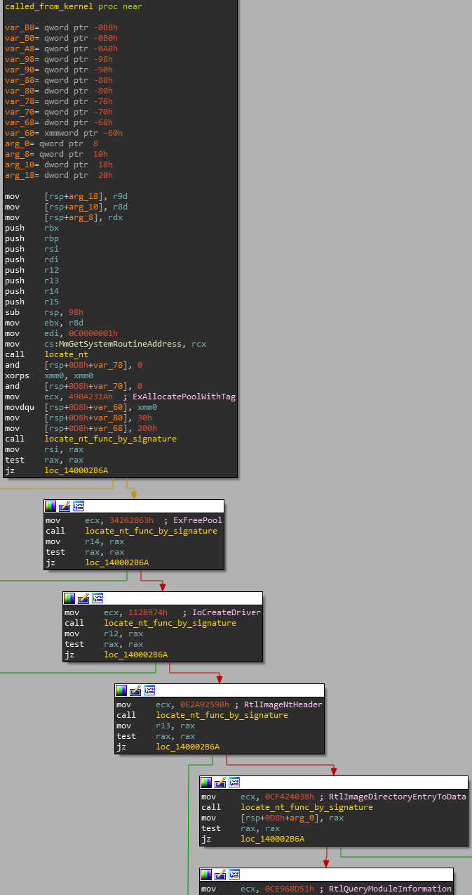

Next `crackstaller.exe` allocates a kernel pool, then copies `driver.sys` into it. After that, it scans for some specific bytes and patches them:

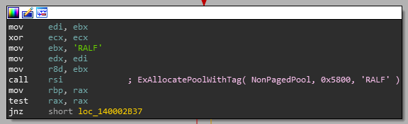
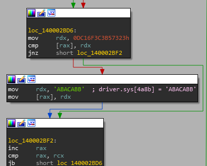

If this patch doesn't occur, later string decryption fails, so this obfuscation is important to take note of. Finally, it creates a system thread at `driver.sys:DriverBootstrap`, where the filter driver loads itself into memory and begins execution:
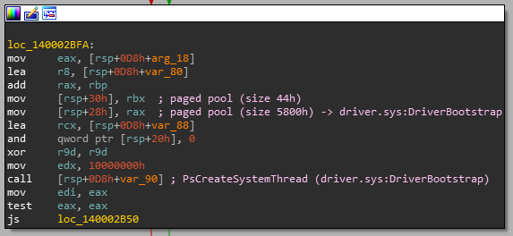

Once `driver.sys` is able to call its `DriverEntry`, it creates a device driver to register a `RegistryCallback` routine through a call to `CmRegisterCallbackEx`, which will scan for registry changes:
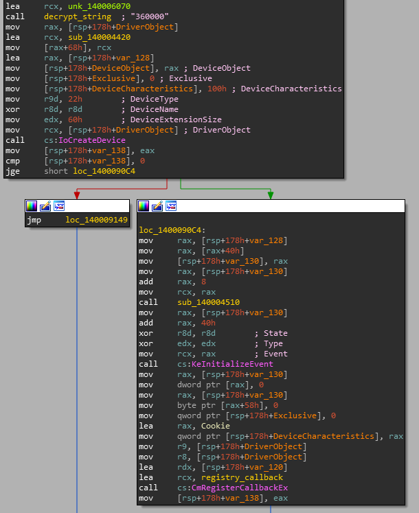

Inside the callback, the filter driver scans for a specific registry key using `wcsstr`:
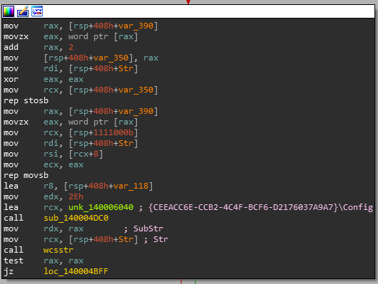

If the string is a match, `driver.sys` does some decryption to retrieve the password `H@n $h0t FiRst!`. Note the `BBACABA` byte string it uses in the decryption. This was set earlier in `crackstaller.exe` before calling `driver.sys`:


The password is expanded into a `wchar_t`, then passed as the `Class` parameter to `ZwCreateKey`:
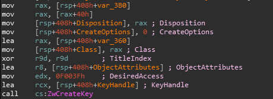

The driver then stops monitoring for registry changes by calling `CmUnRegisterCallback`. So we have some kind of password, apparently the "class" of the registry key `Computer\HKEY_CURRENT_USER\Software\Classes\CLSID\{CEEACC6E-CCB2-4C4F-BCF6-D2176037A9A7}\Config`. We need to see if we can interract with the COM server that was set up. Taking a look inside `credHelper.dll`, note the following two functions that interact with the registry keys found earlier:

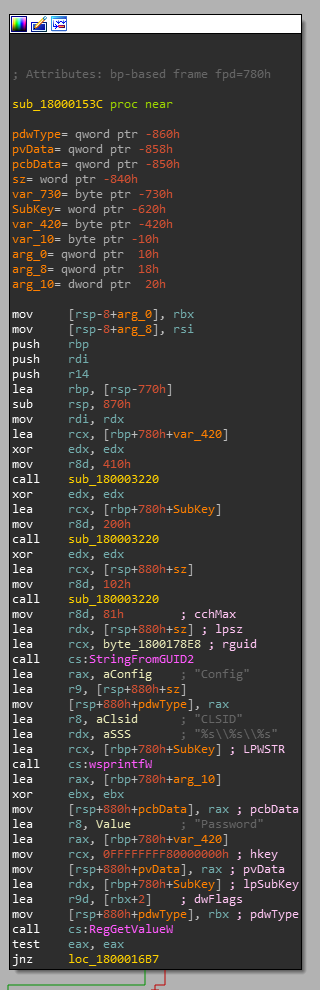
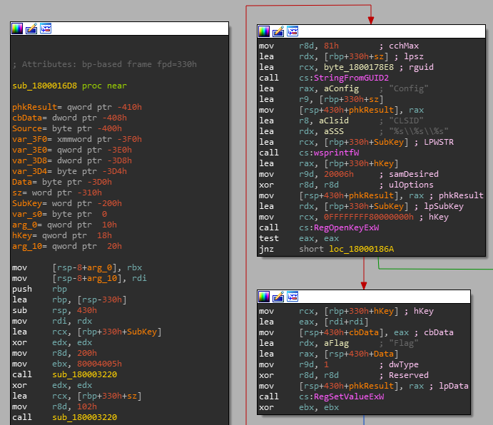

Inside the binary we can also find the bytes for the CLSID being used earlier, as well as an antirely new one:

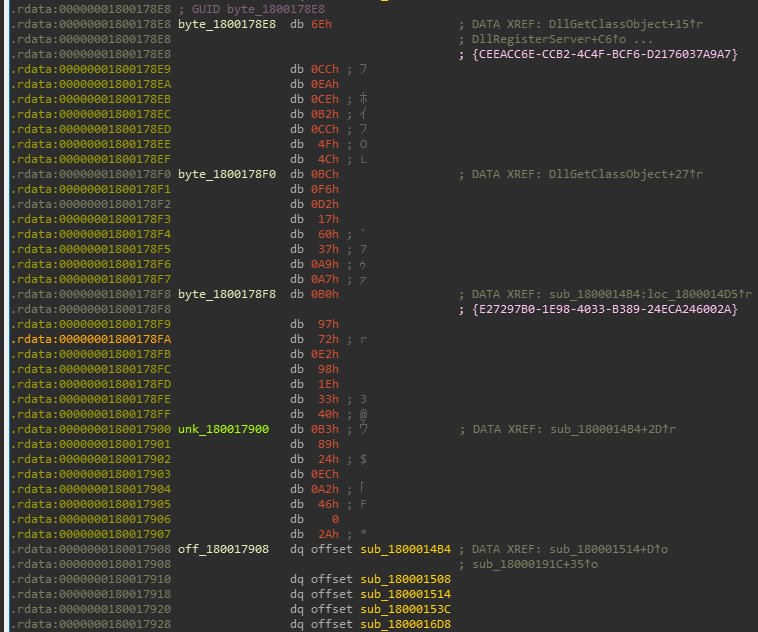
```sh
CLSIDs:
{CEEACC6E-CCB2-4C4F-BCF6-D2176037A9A7}
{E27297B0-1E98-4033-B389-24ECA246002A}
```

Using some C code to interface with the COM server through `CoCreateInstance()` and the second CLSID, we are returned a pointer to a C++ vtable:

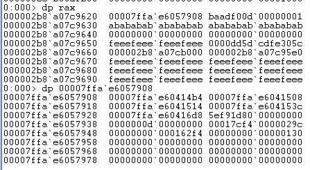
Comparing the last 4 digits of the function pointers (`14b4`, `1508`, ...) to the offsets in IDA in the image above confirms they are the same functions. Now, passing a buffer to the two functions, first to the one that reads the `Password` registry key, then next to the one that sets the `Flag` registry key, the code is able to decrypt the flag using the password and save it to the registry:

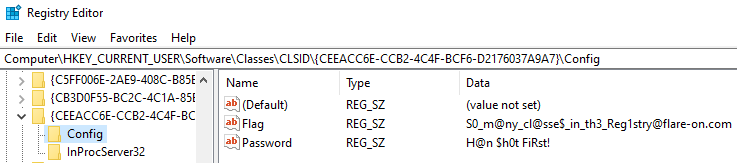

Flag: `S0_m@ny_cl@sse$_in_th3_Reg1stry@flare-on.com`

&nbsp;

Click here for the COM server interfacing C code:
[com.c](../_resources/com.c)